## 前言

从 sqli-labs 第 11 题开始。后续注入点不再是 query string，还是先拿 sqlmap 解决。题目数量很多区别较小，所以重复的思路可能就略了。

## Less-11

Error Based 而且注入点是 POST 表单。用`'`确认`password`字段也有注入后，尝试手工 bypass 验证：`' or 1=1;--` 注意注释符后跟一个空格，但不能在输入框写 `%20`，会被转义成`%%20`。

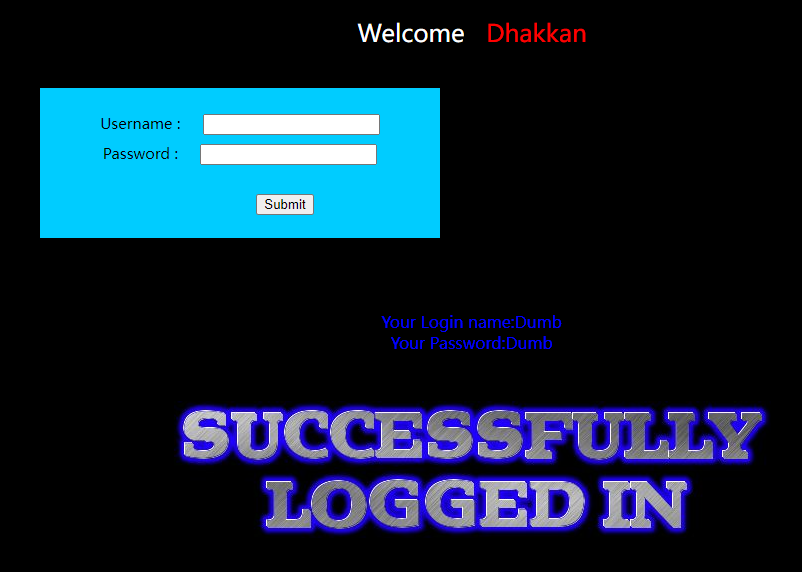

## Less-12

用`"`测出引号类型后根据报错内容补一个右括号，最终 payload `") or 1=1;--` 注意空格。


## Less-13

有报错，提示 double injection 。用`'`测出引号类型，根据错误信息补右括号，`') or 1=1;--` bypass 成功。

也可以用上一篇博客提到的`rand`+`group by`报错的方式。但我是真的越来越不懂 double injection 到底是不是特指某种注入技巧了，还是说就没共识大家对 double injection 各自解释？

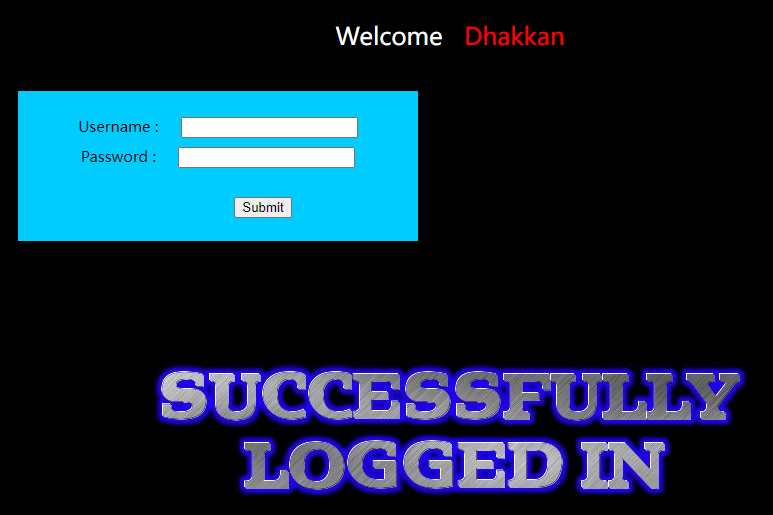

## Less-14

用`"`测出引号类型，根据报错不用补右括号，`" or 1=1;--` bypass 成功。


## Less-15

布尔盲注，测试`'`报错，`' or 1=1;--` bypass 成功。

图就略了。

## Less-16

时间盲注，测试`"`报错，`" or sleep(1);--`无效，补右括号，`") or sleep(1);--` 有效。

## Less-17

这次的表单是更新密码，表单内容用户名和新密码，没有错误回显。

提示 update 注入。update 注入的 SQL 格式化参数的位置一般在 `UPDATE tbl SET col=input col2=input ... WHERE ...` `SET` 后面和 `WHERE` 后面。这里显然 `WHERE` 后面的是用户名 `SET` 后面的是新密码。因为没有明确的目标，越权把 admin 用户的密码改了拉倒。

先确认注入类型，尝试 `admin';-- `、`admin');-- `、`admin";-- `、`admin");-- `、`admin'));--`、`admin"));--`都无效。这就有点气人了。

再试试密码能不能注入，`password';--`，直接把后面的`where`全注释掉。

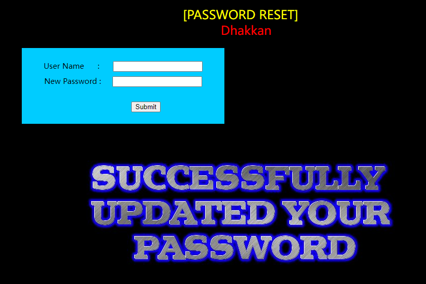

直连 MySQL 验证确认注入生效。

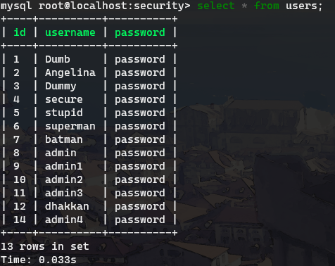

另外也可以用 error based 方式在密码这里注入，爆出 admin 的密码，子查询就行。

## Less-18

提示 Header Injection，尝试正常密码登陆 `admin`、`password` 成功。

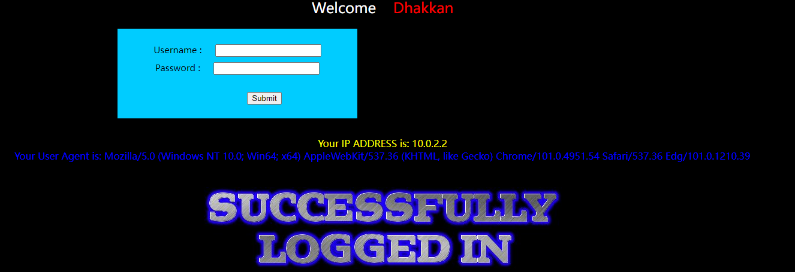

界面上分别是 IP 地址和 UA，没有更多提示，也没找到自定义 HTTP 头，所以初步怀疑注入点是在 UA 里。可以选择用 httpie 或者 curl 发个请求测试。我用 httpie 试下。

```bash
http --form POST 'http://localhost/Less-18/' uname=admin passwd=password submit=Submit "User-Agent:sqli/1.0'"
```

返回

```html
<font color= "#0000ff"  font size = 3 >Your User Agent is: sqli/1.0'</font><br>You have an error in your SQL syntax; check the manual that corresponds to your MySQL server version for the right syntax to use near '172.19.0.1', 'admin')' at line 1<br><br>
```

确认存在注入。剩下的事情就很简单了，写个 req.txt 用 `sqlmap -r req.txt -p User-Agent -T users --dump`爆出用户名密码。

## Less-19

依然是 Header Injection，提示 `Your Referer is ...`，注入点应该在 `Referer` 里，直接把 Less-18 的命令稍微改下。

```bash
http --form POST 'http://localhost/Less-19/' uname=admin passwd=password submit=Submit "Referer:http://im.hacker/'"
```

返回

```html
<br>Your IP ADDRESS is: 172.19.0.1<br><font color= "#FFFF00" font size = 3 ></font><font color= "#0000ff"  font size = 3 >Your Referer is: http://im.hacker/'</font><br>You have an error in your SQL syntax; check  the manual that corresponds to your MySQL server version for the right syntax to use near '172.19.0.1')'  at line 1<br><br><br>
```

确认注入ok，接着用 sqlmap 就行。

## Less-20

提示 Cookie Injection，但是无论登陆成功失败都没有设置 Cookie。尝试随便设置一个 cookie `id=...`，再刷新页面，并无效果，于是开始怀疑是不是说的 `PHPSESSID`，再次尝试`PHPSESSID=1'"`，依然没有作用。发愁。

看了眼 Less-20 的源码，发现代码里明确写了 `!isset($_COOKIE['uname'])`，再试一次`uname=admin'`。

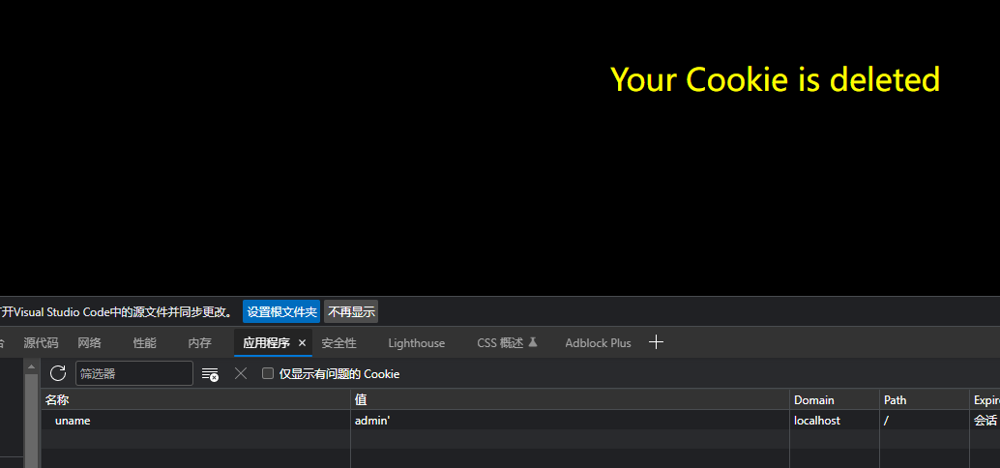

有效果，问题变成了如何完成注入。审阅源码得知只有满足 `isset($_COOKIE['uname'])` 和 `!isset($_POST['submit'])` 的情况下才会进入带查询的分支。所以只需要在这个页面不用`ctrl+r`（因为会重新POST表单），点地址栏再回车就进入了带查询的页面。

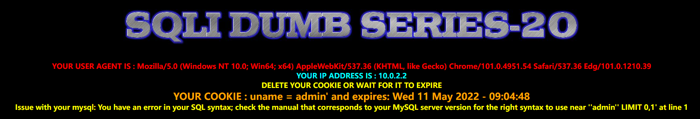

可以看到下方有MySQL的错误信息，接下来只需要用 sqlmap 或者手工构造个 error based 爆破即可。

## Less-21

依然是 Cookie 注入，但是是 `complex` 版本，我倒要看看有多复杂。直接上 Less-20 的 `uname=admin'`。

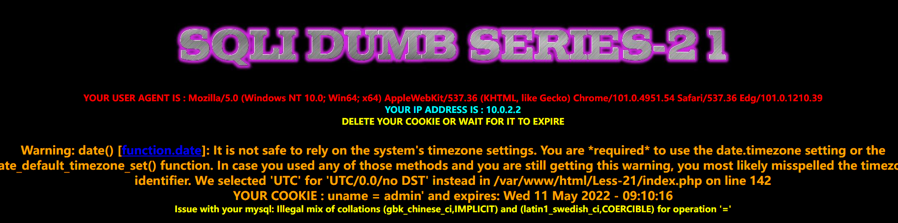

注意有个特殊的错误信息。

```
Issue with your mysql: Illegal mix of collations (gbk_chinese_ci,IMPLICIT) and (latin1_swedish_ci,COERCIBLE) for operation '='
```

谷歌搜索可知这是因为查询的字符集有差异，尝试比较`gbk_chinese_ci`和`latin1`。这里我们了解下`gbk`是宽字符集，定长 2 字节，而 `latin1` 是一个极为特殊的字符集，`ascii`包括了`u+0001~u+0080`，`latin1`正好包括了`u+0080~u+00ff`，也就是单字节除了`0x00`外全部都可以解释成 `ascii` 和 `latin1` 而不出现编码错误，经常被当成默认字符编码。

回到正题，测试中发现`'`没有报错，所以继续尝试`"`，依然没报错，问题变得奇怪起来了。直接开始审阅代码。

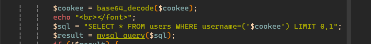

发现有个 `base64_decode`，把 `payload` 编码一下：`YWRtaW4nCg`

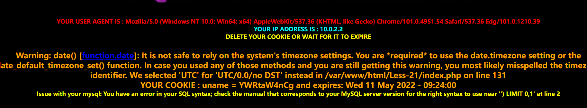

报错成功。接下来手工构造一个 error based 注入或者 sqlmap 加上 base64 tamper 即可。

## Less-22

21和22两题都没法从前端得到太多信息，还是直接看代码。

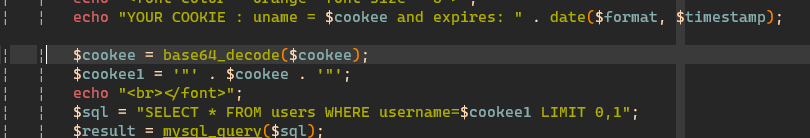

一个 `base64_decode` 加上 `""` 连接，我们编码一下 payload：`YWRtaW4iCg`

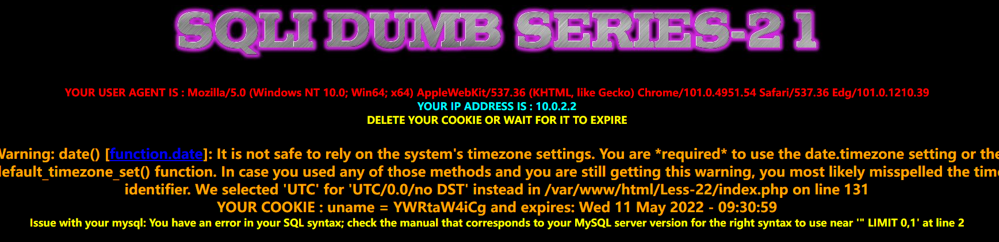

报错成功，接下来手工构造 error based 注入或者 sqlmap 都行，不重复了。

## 总结

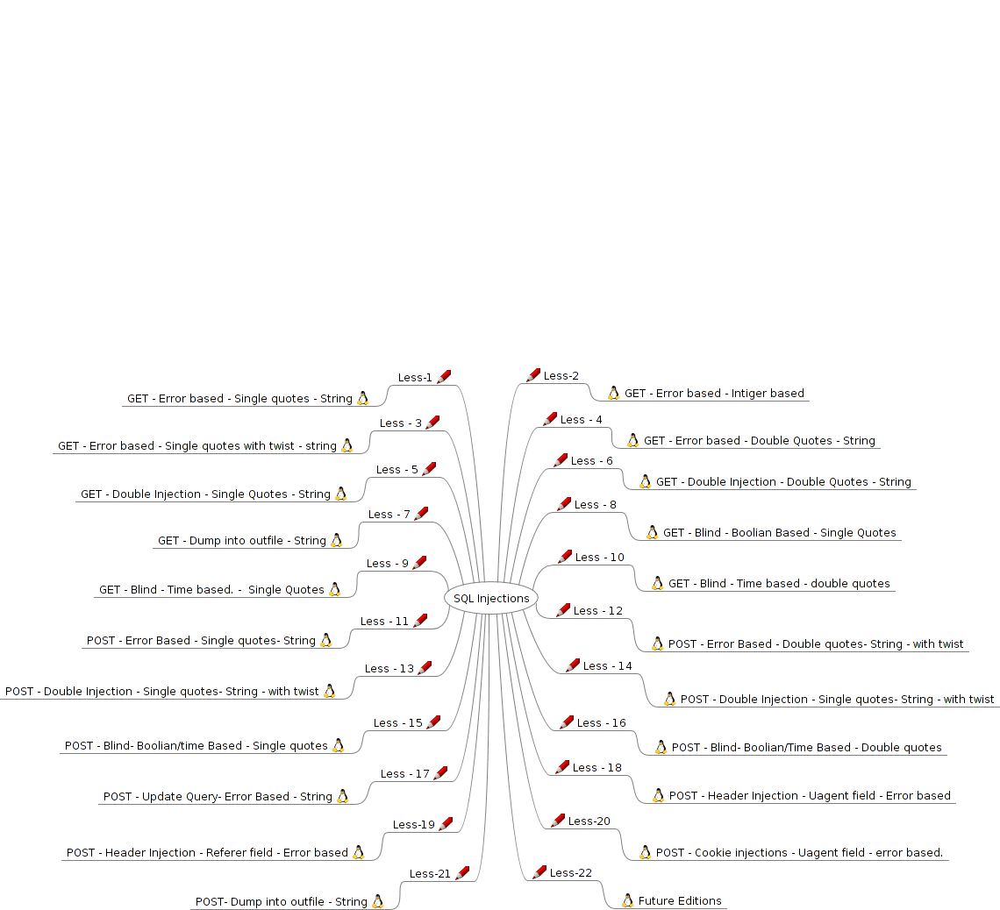

至此，整个 sqli-labs page-1 的所有题目就都做完了。

自我感觉 sqli 的基础应该是掌握差不多了，也有了信心和耐心。考虑接下来是做 page-2 还是找 xss-labs ，打打 xss 的基础。或者一起来也行，预计 page-2 可能会稍难点，大概，做不过就试试 xss-labs。

