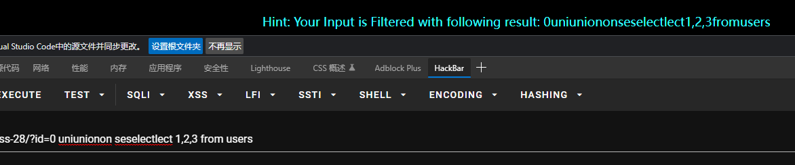
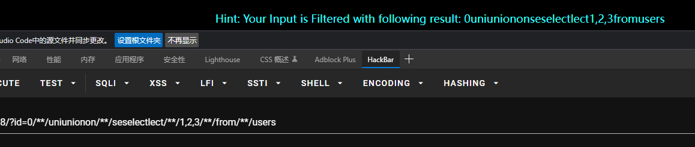
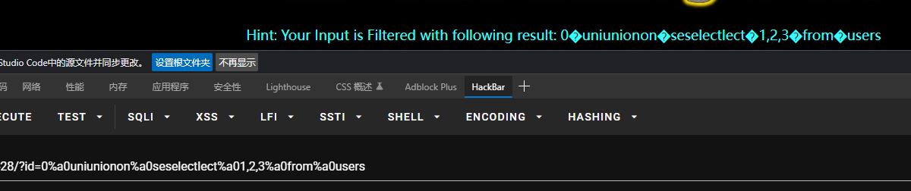
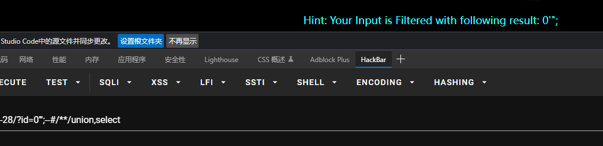
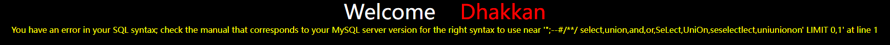
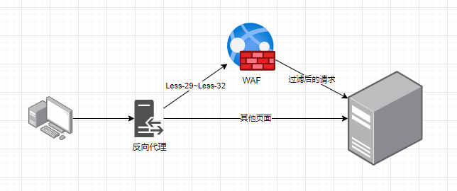
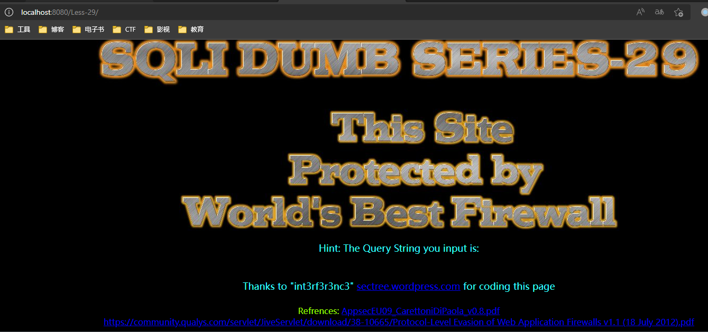
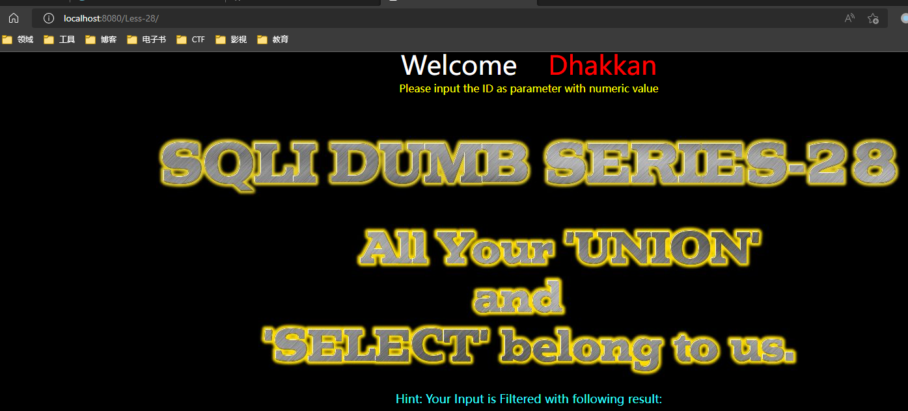
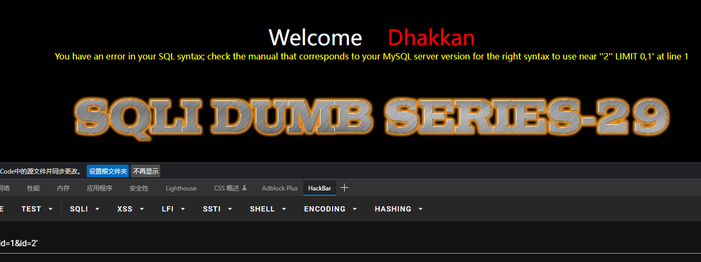

## 前言

惯例。

随便刷两题。

## Less-28

没有错误回显，有查询结果。提示 all your 'union' and 'select' belongs to us ，和 27 一样的提示，不同的是 union 和 select 加了引号。不知道想表达什么。

验证注入类型 `?id=1' and '1'='1` + `?id=1' and '1'='0` 确定是字符型注入，单引号。注意服务端可能有个类型转换导致 `1 and 1=1` 这样的 payload 也有回显，通过构造为假的条件可以发现并不是数字型注入。

从提示看是过滤了 union 和 select 但不知道怎么过滤的，尝试双写 bypass，发现空格被过滤了。



尝试`/**/`替换空格 bypass ，发现依然无效。



尝试 `0xa0` 替换空格。



看起来ok了，但看起来完全没过滤 union 和 select ，把双写去除后重试，依然没有回显，茫然。

好吧，重新整理思路。先测试下过滤了什么东西 `?id=0'";--%23/**/union,select`



注意到只剩下了 `'";` 幸存，前面有个双写和`%a0union%a0`没被替换，所以初步怀疑正则可能是`\b(union|select)\b`。尝试大小写也被过滤了，所以正则匹配应该还有个 `i` 标志。

这种情况我有个思路是走盲注，用`AND IF(...)`爆破。尝试`?id=1'%a0and%a0if(ascii(substring(password,1,1))>0,true,false)%a0and%a0'1'='1` 有回显，条件改成`<0`则无回显。继续爆破即可。

再给其他人的思路参考：

- 审阅代码可知正则并不是我猜测的`\b(union|select)\b`，而是`union\s+select`，因此可以被`%a0`绕过，正常`union select` 或者 `union all select` 可破。

## Less-29

提示 protection with WAF, this site protected by world's best firewall.

测试过滤了什么东西。`?id=1'";--%23/**/%20select,union,and,or,SeLect,UniOn,seselectlect,uniunionon`



发现什么都没过滤，看起来是单引号字符型注入。尝试 Less-28 的盲注 payload 发现成功。什么鬼？

尝试 `?id=0' union select 1,version(),database() --%20` 发现也直接成功。

WAF，看看你都保护了个啥。

### WAF设置

经查，原来是我挑的这个分支 docker-compose 部署有问题=。=

WAF 并不属于 PHP，而是 jsp 的，在仓库目录下有个 `tomcat.zip` 保存了 WAF 的内容，需要单独部署。

参考[sqli-labs: Less-29 - Less-31](https://www.jianshu.com/p/46cb6c354de5) 这篇文章了解到架构大体上就是 tomcat 过滤参数后反代 apache 服务，但仔细看了下 WAF 内容发现没有对 Less-29~Less-32 之外的页面反代，导致把 tomcat 挂在 80 端口的话就访问不到其他没设置 WAF 的页面。

合理的架构应该是这样。



修改 `docker-compose.yaml` 如下

```yaml
version: '3'
services:
  reverseproxy:
    image: "nginx:mainline"
    depends_on:
      - web
      - waf
    ports:
      - 80:80
    links:
      - web:web
      - waf:waf
    volumes:
      - "./etc/nginx_default.conf:/etc/nginx/conf.d/default.conf"
  db:
    image: "mysql:5.7.33"
    environment:
      MYSQL_ROOT_PASSWORD: toor
      MYSQL_ROOT_HOST: "%"
    ports:
      - 3306:3306
  web:
    depends_on:
      - db
    image: "php:5.3-apache"
    volumes:
      - ".:/var/www/html"
      - "./etc/apache_default:/etc/apache2/sites-available/000-default.conf"
      - "./etc/htaccess:/var/www/html/.htaccess"
    environment:
      DB_HOST: "db"
      DB_PASS: "toor"
    links:
      - db:db
  waf:
    depends_on:
      - db
    image: 'tomcat:jre8-openjdk-bullseye'
    volumes:
      - "./WAF/sqli-labs:/usr/local/tomcat/webapps"
      - "./mysql-connector-java.jar:/usr/local/tomcat/lib/mysql-connector-java.jar"
    links:
      - db:db
      - web:web
```

添加`waf`和`reverseproxy`，`waf`用`tomcat`官方容器不需要配置，但源码`index.jsp`里请求地址要改。还要从 MySQL 官网单独下载一个 `mysql-connector-java` 的 jar 包挂载进去。

`reverseproxy` 用 `nginx:mainline`，简单配一下反代规则。

```nginx
upstream lab {
    server web;
}

upstream tomcat {
    server waf:8080;
}

server {
    listen       80;
    listen  [::]:80;
    server_name  localhost;

    location / {
        proxy_pass http://lab;
        proxy_set_header Host $http_host;
        proxy_set_header X-Real-IP $remote_addr;
    }

    location ~ ^/Less-(29|30|31|32)[a-zA-Z]?/ {
        proxy_pass http://tomcat;
        proxy_set_header Host $http_host;
        proxy_set_header X-Real-IP $remote_addr;
    }
}
```

到这一步就应该能同时访问 WAF 和其他题目了。





### 重新解题

审阅下WAF代码。

```jsp
<%
// ... 略
String rex = "^\\d+$";
Boolean match = id.matches(rex);
if(match==true) {
    // ... 请求 web 服务
} else {
    response.sendRedirect("hacked.jsp");
}
```

看起来无懈可击，正则匹配整个`id`参数必须是纯数字。再看下 Less-29 原题代码，`select * from users where id='$id' limit 0,1`，好了这题我确实不懂了，知识盲区。看别的大佬的题解：

> **问：**`index.php?id=1&id=2`，这时回显是`id=1`还是`id=2`呢？
>
> **答：**apache (php) 解析最后一个参数，即回显`id=2`；tomcat (jsp) 解析第
>  一个参数，即回显`id=1`。
>
> 作者：Hyafinthus 链接：https://www.jianshu.com/p/46cb6c354de5

这是一个利用 `apache+php` 和 `tomcat+jsp` 对重名 query string 参数解析结果的绕过。我们尝试下 `?id=1&id=2'`，成功绕过。



剩下就不多谈了，把注入的 payload 放到第二个参数里就可以绕过 WAF 的防御。

最后补充一点如何判断服务器类型。一个主要的办法就是看 HTTP 响应里的 `Server` 头——但一般多个服务器后端的情况下，更可能出现的是一个大反代服务去代理其他所有服务，根据 url 来匹配转发。这种情况下 `Server` 头一般就固定是反代服务器了。在这题里是`nginx/1.21.6`，我们看不到`apache`和`tomcat`。

另一种方法是靠经验判断=。=一般来说，写 php 的喜欢配 apache 或者 nginx，写 jsp 的会优先考虑java的容器比如`tomcat`。写 go 的一般裸奔或者配个 nginx 反代，Python 就可能是 uwsgi 或者别的实现 WSGI 协议的服务器或者裸奔，现在也可能有 ASGI 的服务器。这些只能靠对后端生态的了解来猜测了。如果是前后端分离架构的话，后端开发语言和环境的特征就更难找了。

## Less-30

WAF，无错误回显，有正确回显，字符型注入双引号。

可以考虑用 `union select` 解决，WAF 绕过方法和 Less-29 一样。

## Less-31

和 Less-30 一样。 WTF ？看了眼源码发现就多了一个右括号。

## 总结

时间有限，还得抓紧开始看自考的课程。今天就先这样意思意思，没别的意思。

sqli-labs 的 WAF 感觉怪怪的，不像是之前见过的 php 的 WAF，绕过的思路感觉还是比较有趣的，反代形式的WAF如果不注意可能会被这个问题坑到。

28题审阅源码才发现过滤方法有漏洞，测 SQL 注入问题的时候还得多准备点各种 payload。我感觉是有很大自动测的空间，可以自己写个测试脚本啥的，但 sqlmap 珠玉在前=。= 或许有机会看看 sqlmap 源码会有更多启发。

今天就这样，辛苦我自己啦。