## 前言

sqli-labs 是一个开源的 SQL 注入学习平台，最近更新已经是 2014 年了，也是个老项目。不过 sqli-labs 提供的靶场更大，包含 4 个难度级别，每个难度十几题，总共 65 题。

感觉会比 dvwa 难一大截，用来学 SQL 注入的玩法肯定是绰绰有余了。

本篇应该是 sqli-labs *Basic Challenges* 系列 WP 的开始。

## 环境搭建

### 部署方案

两种部署方式，一种是在虚拟机里安装 LAMP 环境（包管理或者别的什么一键安装都行），另一种就是 docker 容器化。显然容器化对靶场玩家更友好。所以我选择容器环境。

这里使用了一个原 sqli-labs 的分支，[aljavier/sqli-labs](https://github.com/aljavier/sqli-labs)，省下自己写 docker-compose 和 dockerfile 找环境适配的时间。未来发现配置有问题再自己改改。

### 虚拟机环境准备

虚拟机系统选 Ubuntu 或者 Debian ，或者随你喜欢。安装 docker 和 docker-compose，具体步骤自己看文档。

可能还有些需要准备的东西，如果宿主机上没有的话可以考虑在虚拟机里安装，比如 `sqlmap` ，还有需要命令行直连 MySQL 的话可以再装个 `mycli`。其他就是些个人偏好的开发环境，用来写打靶的小工具小脚本什么的。vim 配置 ohmyzsh 这些就不用提了。

### 部署启动

```bash
git clone https://ghproxy.com/github.com/aljavier/sqli-labs
cd sqli-labs
docker-compose up -d
```

我额外干了点可能没必要的事情，因为注意到 `index.html`、`readme.md` 之类很多文件都有 `x` 权限位，这可能是因为在 Windows 上用 Git 提交导致的权限错误，所以我顺便 `find . -executable -type f -name '*.html' | xargs -I{} chmod -x` 把权限清理了一下。带`x`权限的文件比较多也不只是`html`，总之最后是全都去掉了`x`权限。

之所以说没必要是可能影响之后的注入利用，总之这一步随意。

## 初探

### 总览

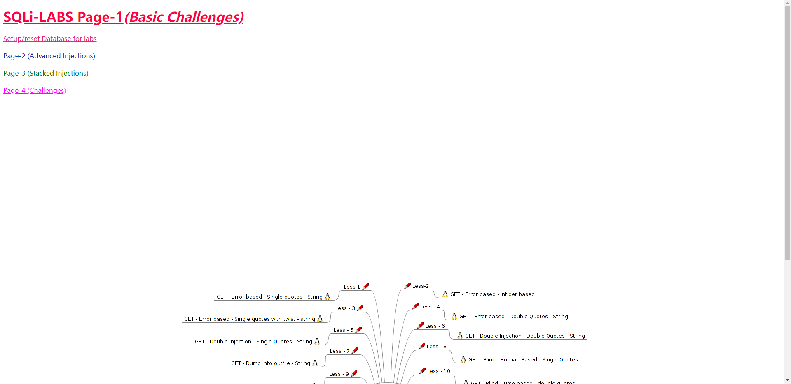

UI设计有点拉。左上角是切换不同难度和重置数据库，可以看到除了 `Page-1(Basic Challenges)` 还有 3 个难度。

下面的脑图就是这个难度下的 *关卡* 了。

### Less-1 Error-Based string

随意打开第一题。

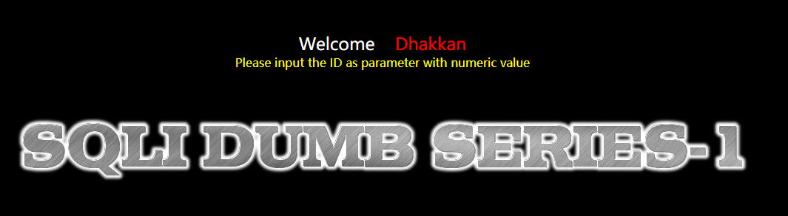

提示输入数字ID作为参数，提示有点模糊，正确做法是在URL里添加`?id=1`这样的 query string。上一页有明确提示 `single quotes`，这里给一个`'`就会报错：

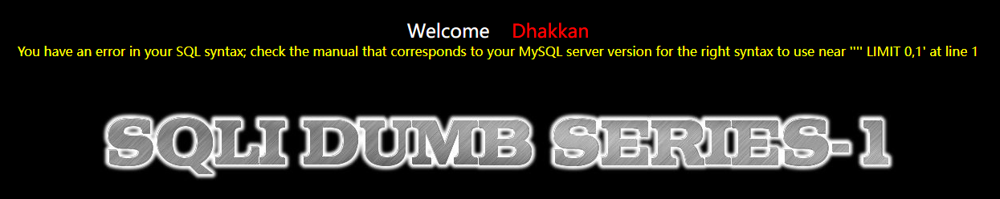

但奇妙的是这里看似是数字型注入，给`?id=1 and 1=1`正确返回。但如果多测一下`?id=1 and 1=0`就会发现依然是正确返回，所以造成这一结果应该是 php 5.x 的字符串转数字中丢掉了后面的`and 1=1`。

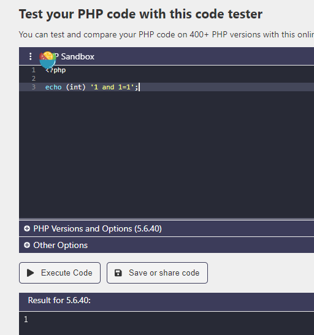

所以按字符型注入处理即可。确定要补`'`之后就可以继续了。这题主题是 Error Based，所以我们构造一个 Error Based 注入。`?id=1' and extractvalue(1,concat('~',version())) -- `。注意`--`后的空格，浏览器会自动删掉URL前后的空格字符，可以手动在末尾补一个URL编码的空格符`%20`。

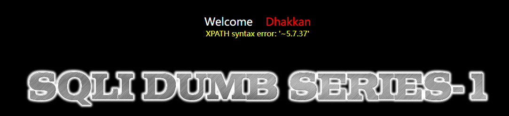

到这就完成了利用。

### Less-2 Error-Based Intiger

应该是想写 Integer。

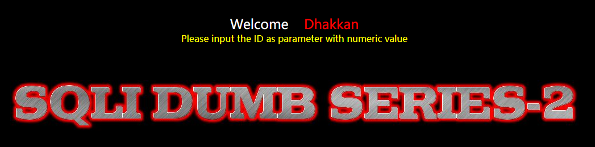

初始提示一样，尝试`?id=1 and 1=1`和`?id=1 and 1=0`之后发现存在注入，提示 Error-Based，选择和上一题同样的 Payload 去掉`'`可破。

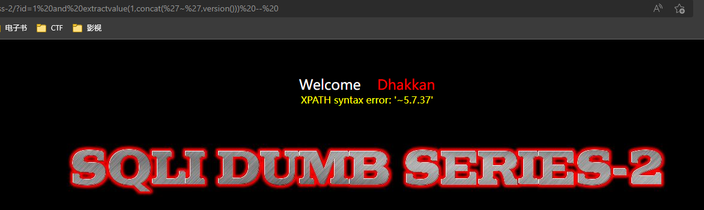

### Less-3 Error-Based Single-quotes with twist

一样的提示。

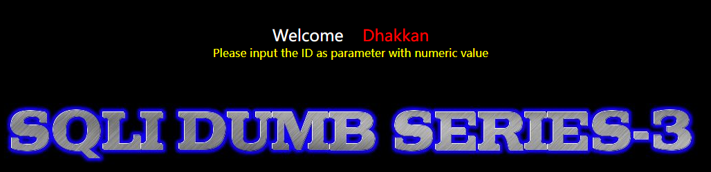

但这题有点不一样的地方，尝试`?id=1' and 1=1 --%20`会发现依然报 SQL 语法错误。

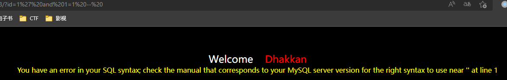

试了下`?id=1; -- %20`。

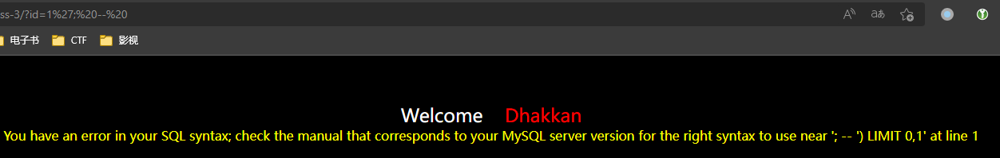

没辙了，看一眼参考答案（源码）。


所以是我少给了个`)`。这时候才后知后觉发现语法错误报错里已经有提示了，`near '; -- ') LIMIT 0,1`，这里有个右半括号。

所以把第一题的 payload 改一下，`?id=1') and extractvalue(1,concat('~',version())) --%20`

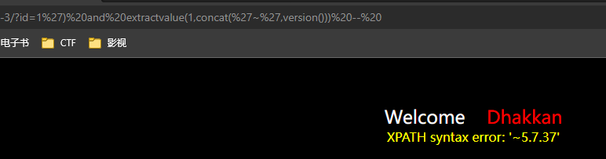

这关就算 pass 了。

教训是不要忽视细节。

### Less-4 Error-Based Double Quotes

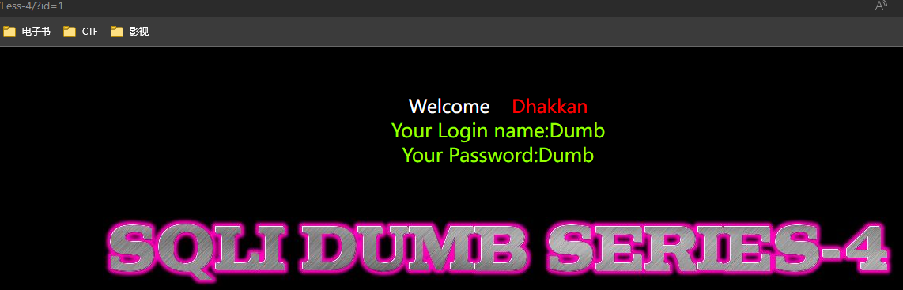

提示 `DoubleQuotes`，MySQL 的字符串可以用双引号 `"`，这里试一下 Payload `?id=1" and 1=0`。

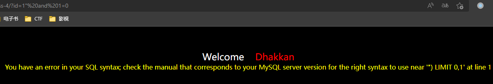

发现有错误，从错误信息来看有个`")`，我们稍微改下 paylaod 再加上注释符：`?id=1") and 1=0; --%20`

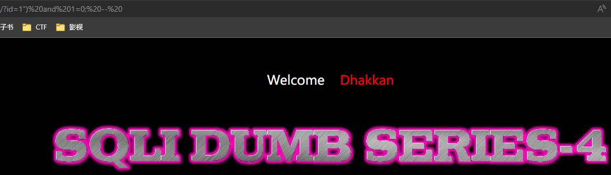

成功，现在还是用 `extractvalue` 提取信息：`?id=1") and extractvalue(1,concat('~',version())); --%20`

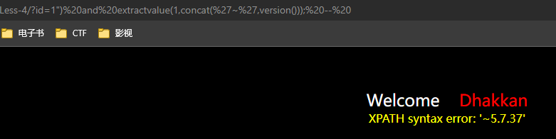

成功。

## 总结

吸收的教训还是两个字，细心。

另外还有个关于 payload 的问题。error-based injection 需要错误回显里给出参数字段的值，满足这个条件的函数不多，我只知道 `updatexml` 和`extractvalue`是肯定ok的，前一篇 red tiger 的打靶笔记里记录了另外两种方法（BIGINT UNSIGNED溢出和`ST_LongFromGeoHash`，溢出法在 5.7好像不行了）但少有用起来。

在使用 `extractvalue` 这个 payload 过程里会有疑问，为什么要有一个`concat('~', version())` 而不是直接 `extractvalue(1,version())`？其实实测一下就会发现 dump 出来的数据不完整或者干脆不报错。原因也很简单，`extractvalue`是个`xml`函数，第二个参数是`xpath`。`xpath`的语法正好会允许很多格式的数据，比如单纯整数或单词，当成合法的`xpath`表达式。

比如上面的 Less-4 ，用 `?id=1") and extractvalue(1,database()); --%20`这个payload会发现页面不报错，因为`database()`返回的`security`正好可以当成`xpath`表达式被识别，虽然没从第一个参数里提取出任何东西，但也没触发MySQL错误，也就拿不到第二参数的内容了。

看似没用的`concat('~', col)`，但实际上起到一个重要作用。它添加的一个`~`让参数不论是什么格式，都不能当成`xpath`识别，也就让 MySQL 能稳定地抛出错误，让我们稳定地从错误信息里拿到`extractvalue`第二参数的内容。