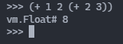

## 前言

之前写了个s表达式求值器，很简陋，直接在抽象语法树上执行。只是这样的话其实还没啥意思，所以再试试改进成在基于栈的虚拟机上执行。

## 0x01 虚拟机模型

首先得承认对这些语言层级的虚拟机不熟，基本是随便设计的。

### 对象模型

虚拟机指令操作的目标是 **对象** ，包括内建的对象和用户定义的对象，虚拟机指令操作的基本单位也是对象。

目前关注的是内建的对象，简单抽象出了几个基本类型。

```go
type Object interface {
	TypeName() string
}

type UInt uint64

func (u UInt) TypeName() string {
	return "UInt"
}

type Float float64

func (f Float) TypeName() string {
	return "Float"
}

type Boolean bool

func (b Boolean) TypeName() string {
	return "boolean"
}

type String string

func (s String) TypeName() string {
	return "string"
}

type Symbol string

func (s Symbol) TypeName() string {
	return "symbol"
}

type Nil struct{}

func (n Nil) TypeName() string {
	return "nil"
}
```

省略了一部分，领会精神即可。上面定义的 `Symbol` 类型其实就是 `#ident` 这种语法元素，目的是保持语义上的简洁。

比如说 `(let a b)`，在 minilang 里解释成以`a`和`b`作为参数，调用`let`函数，`a`和`b`都会被求值。`let`是一个内置函数，在当前环境里定义一个新的变量并设初值。

可实际写代码的人想要的可能是 *定义a，初始化为b*。这种情况下我们不希望`a`被求值，而是字面意思：标识符`a`，传给`let`函数。这种情况下就可以用 `(let #a b)` ，`#a` 表示一个 `Symbol` 类型的字面量。

或许有人会注意到本质上来说`#a`是个语法糖，也可以被写成 `(quote "a")` 这样的形式。`quota` 定义为将字符串构造成 `Symbol` 对象的函数。

### 指令集

有了基本的对象模型，再定义最基本的指令。因为考虑将代码也视作数据，所以目前的想法还是把控制结构也做成内置函数，因此指令集里不需要太多转移指令。

暂定的指令集如下。

```go
type OpCode int32

const (
	RESERVED = iota
	// CALL <STR>
	// 压栈下一条指令的地址，跳转到指定位置
	CALL
	// RET <OBJ>
	// 取栈顶的对象作为跳转地址，压栈返回值
	RET
	// LOAD <STR>
	// 读取局部环境里的变量压栈
	LOAD
	// PUSH <NUM>
	// 压栈对象
	PUSH
	// POP <NUM>
	// 出栈一定数量的对象，出栈的对象直接丢弃
	POP
)

func (o OpCode) String() string {
	return []string{
		"RESERVED",
		"CALL",
		"RET",
		"LOAD",
		"PUSH",
		"POP",
	}[o]
}
```

除了最初的  `RESERVED` 是故意占用了零值，剩下的就是有效的指令了。

写过 x86 汇编的话会看的很不习惯，因为完全没考虑寻址。

- `CALL` 指令的操作数对象是字符串的时候，在本地环境寻找对应名称的内建函数；
  - 或者，操作数是 UINT 的话，压栈下一条指令地址后跳转到指定位置，和 x86 汇编类似；
- `RET` 把当前栈顶的变量(UINT)当成下一个指令的地址
- `LOAD` 在本地环境寻找对应名称的变量压栈

剩余略。其实可以看出直接对机器编程中的寻址被替换成了根据变量名（字符串）查找本地环境，很多高层级的概念（对象、字符串）被糅杂在里面。

## 0x02 编译

接下来是把抽象语法树翻译成指令序列。

### 字面量翻译

因为 minilang 的指令直接操作对象，所以能很省事地把字面量都构造成相应地对象。对于更复杂的对象，也可以编译成构造指令，当然目前不涉及。

举个例子，列表字面量 `#(display hello)`。可以在编译过程里直接构造出 `List` 对象，然后生成一个 `PUSH List{}` 指令，这样做的好处是更简单，效率会更好一点，毕竟少几个解释执行的指令。相应的限制是不能引用环境里的变量，因为在构造字面量对象的过程里还没有进入运行时环境。

比如说 `#(display name)`，如果编译成 `PUSH List{display, name}`，那么`name`在此刻就不能被求值，必须延迟到执行的时候才能求值`name`。这里又涉及编译期的计算，比如我可以定义一个编译阶段执行的指令格式 `[elem...]`，编译的时候对 `[elem...]`求值，求值结果写进编译出的指令里。也是后话。

编译成指令的好处是之后要做 JIT 或者全量编译成本地代码的话，不需要重新处理这个字面量，写一堆 case 把字面量编译成几个函数调用。

扯远了，先前我们拿 `gocc` 生成好了语法树，接下来就是简单地做一下翻译。

```go
case ast.Boolean, ast.UInt, ast.Float, ast.Symbol, *ast.Quoted, ast.String:
	instructions = append(instructions, push(vm.ObjectFromLiteral(node)))
```

其中 `vm.ObjectFromLiteral(node)` 就是负责把从抽象语法树节点构造出对象实例的函数。

```go
func ObjectFromLiteral(node ast.Node) Object {
	switch node := node.(type) {
	case ast.Float:
		return Float(node)
	case ast.UInt:
		return UInt(node)
	case ast.String:
		return String(node)
	case ast.Boolean:
		return Boolean(node)
	case *ast.Quoted:
		lst := &List{}
		for _, n := range node.GetValue().([]ast.Node) {
			lst.underlying = append(lst.underlying, ObjectFromLiteral(n))
		}
		return lst
	case ast.Symbol:
		return Symbol(node)
	default:
		log.Fatalf("unexpected ast node in ToValue %v(%T)", node, node)
	}
	return nil
}
```

`Quoted` 表示列表字面量。这个函数本身很简单很直白，限制是对于非字面量的节点不能求值（比如 Identifier、函数调用都只能在运行时求值）。

### 函数调用翻译

接着就是重头戏，函数调用的翻译。

```go
case *ast.List:
    elements := node.GetValue().([]ast.Node)
    if len(elements) == 0 {
        return make([]vm.Instruction, 0), nil
    }

    // 参数从右到左压栈
    for i := len(elements) - 1; i > 0; i-- {
        if inst, err := c.Compile(elements[i]); err != nil {
            return nil, err
        } else {
            instructions = append(instructions, inst...)
        }
    }

    // 压入参数数量
    instructions = append(instructions, push(vm.UInt(len(elements)-1)))

    // 插入调用语句
    callee := elements[0]
    if ident, ok := callee.(ast.Identifier); ok {
        instructions = append(instructions, vm.Instruction{
            OpCode:  vm.CALL,
            Operand: []vm.Object{vm.Symbol(ident)},
        })
    }
```

谈函数调用的编译前必须先确定好调用约定。这里采用了和 cdecl 类似的调用约定，参数从右往左压栈，同时在最左添加一个参数数量的参数，就像是 `object f(object argc, object ...argv)` 一样，领会精神。

函数的返回值一律包装成 object 返回，不允许多返回值（但可以考虑加个解构语法之类的糖），返回值也通过栈传递。

整个函数调用的过程可以描述为：

1. 调用方参数压栈
2. 调用方参数数量压栈
3. 调用方返回地址压栈
4. 调用方跳转到函数入口（或者进入内置函数）
5. 被调方弹出返回地址
6. 被调方弹出所有参数
7. 被调方压栈返回值
8. 被调方跳转至返回地址

一句话概括就是被调方清栈，返回值放在栈顶。对于内置函数，步骤5-8都要在内置函数里完成。之后做用户定义 `procedure` 的话就要在 `procedure` 编译结果里加上平栈的代码了。现在还在纠结 `POP` 指令直接把弹出的对象给丢弃了，该怎么暂存返回地址。实在不行就改成调用方清栈得了。

## 0x03 虚拟机抽象

虚拟机理解为一个状态容器，包括指令空间（指令集合和指令指针）、数据空间（栈、本地变量），给一个简单的构造器。

```go
type MiniVM struct {
	Stack        []Object          // 栈空间，包括传参和本地变量都存放在这里
	Top          int               // 栈顶地址
	Locals       map[string]Object // 本地变量，从这里查找变量和可调用的对象
	IP           UInt              // Instruction Pointer 指令指针
	Instructions []Instruction     // 程序指令集合
}

func NewMiniVM(instructions []Instruction) *MiniVM {
	return &MiniVM{
		Stack:        make([]Object, 0),
		Top:          -1,
		IP:           0,
		Instructions: instructions,
		Locals:       make(map[string]Object),
	}
}
```

然后定义每个指令的执行逻辑。这里其实有点像是设计模式里的命令模式（Commnad Pattern）。

```go
func (m *MiniVM) instCall(inst Instruction) error {
	if len(inst.Operand) == 0 {
		return fmt.Errorf("invalid CALL instruction: %s", inst)
	}

	if sym, ok := inst.Operand[0].(Symbol); ok {
		if proc, err := m.LookupProc(string(sym)); err != nil {
			return err
		} else {
			if proc.isBuiltin {
				m.Push(UInt(m.IP + 1))
				return proc.Builtin(m)
			} else if proc.Location != 0 {
				m.Push(UInt(m.IP + 1))
				m.IP = UInt(proc.Location)
			} else {
				log.Fatalf("invalid Procedure object")
				return nil
			}
		}

		return nil
	}

	log.Fatalf("invalid CALL instruction operand %v", inst.Operand)
	return nil
}

func (m *MiniVM) instRet(inst Instruction) error {
	if len(inst.Operand) == 0 {
		return fmt.Errorf("invalid RET instruction: %s", inst)
	}

	returnAddress := m.Pop().(UInt)
	m.IP = returnAddress
	m.Push(inst.Operand[0])
	return nil
}

func (m *MiniVM) instPush(inst Instruction) error {
	if len(inst.Operand) == 0 || len(inst.Operand) > 1 {
		return fmt.Errorf("invalid PUSH instruction: %s", inst)
	}

	m.Push(inst.Operand[0])
	return nil
}

func (m *MiniVM) instPop(inst Instruction) error {
	if len(inst.Operand) == 0 || len(inst.Operand) > 1 {
		return fmt.Errorf("invalid POP instruction: %s", inst)
	}

	m.Pop()
	return nil
}

func (m *MiniVM) instLoad(inst Instruction) error {
	if len(inst.Operand) == 0 || len(inst.Operand) > 1 {
		return fmt.Errorf("invalid LOAD instruction: %s", inst)
	}

	if name, ok := inst.Operand[0].(Symbol); ok {
		if v, ok := m.Locals[string(name)]; ok {
			m.Push(v)
		} else {
			return fmt.Errorf("undefined name %s", name)
		}
	} else {
		return fmt.Errorf("unexpected operand for instruction LOAD %v(%T)", inst.Operand[0], inst.Operand[0])
	}
	return nil
}

func (m *MiniVM) ExecNextInstruction() error {
	if int(m.IP) >= len(m.Instructions) {
		return ErrNoMoreInstructions
	}

	inst := m.Instructions[m.IP]
	switch inst.OpCode {
	case CALL:
		return m.instCall(inst)
	case RET:
		m.instRet(inst)
	case PUSH:
		m.instPush(inst)
	case POP:
		m.instPop(inst)
	case LOAD:
		m.instLoad(inst)
	default:
		return fmt.Errorf("unexpected opcode %v", inst.OpCode)
	}
	m.IP++
	return nil
}

```

## 0x04 结果展示



PS：这个 `+` 也是函数。

## 总结

这个简单的 VM 写的时候脑子里想的都是 x86 汇编和 Python 的类型，所以内置类型定义就很粗暴，指令 OpCode 定义也是想当然。写成这样当然还是不满意的，都费了这么大劲了，简简单单做个 JIT 不过分吧？

但讲老实的，我还真不知道不用 CGO 的情况下，我就算是拿 `syscall` 这个包分配好了读写执行的空间也成功汇编出了机器码，也不知道怎么去调 Go 里定义的函数和数据结构。这一点看，要是一开始拿 C 写的话，问题就会好解决很多：够底层嘛，不用担心移植性和运行时的封装。

不过也不是真的一点办法也没有，干脆把内建类型和函数全部拿 C 或者 minilang 自己实现就好了，定义好数据结构，minilang 编译出来的指令全是调用自己或者调用C函数，再想翻译到汇编指令就简单很多了。到了这一步，直接拿 minilang 写一个编译自己的编译器也不是不行。