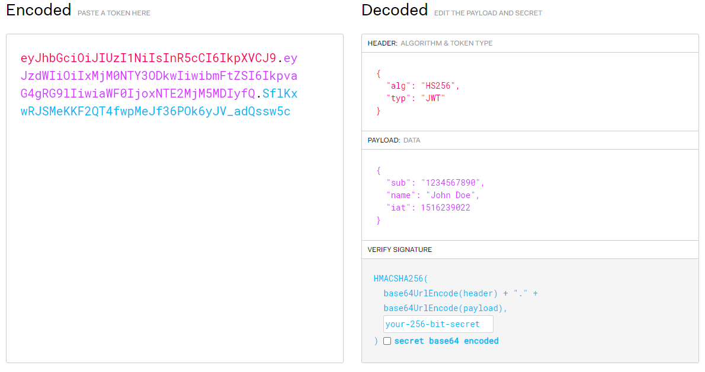
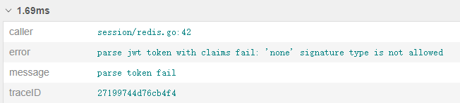

## 前言

今早翻到[p神挖MinIO CVE的文章](https://www.leavesongs.com/PENETRATION/the-collision-of-containers-and-the-cloud-pentesting-a-MinIO.html)，注意到几句话：

> jwt常见的攻击方法主要有下面这几种：
>
> - 将alg设置为None，告诉服务器不进行签名校验
> - 如果alg为RSA，可以尝试修改为HS256，即告诉服务器使用公钥进行签名的校验
> - 爆破签名密钥

虽然早早在项目里用上了jwt（大概是16~17年，在另一家公司的登陆系统里），但在目前任职的公司用上jwt的时候还真没从安全的角度考虑过如何编写 **正确、安全** 的 jwt 验证代码。<small>悄悄哔哔一句我也不是搞安全的啊（</small>

既然翻博客的时候看到了，就没法当没看见。正好翻翻看自己写的垃圾代码是不是有洞。

## 开始 review

因为这项目后端是微服务架构，身份验证实际上分成了两种情况：

1. 提供验证的服务，从 redis/mysql 校验身份
2. 其他服务，通过 rpc 请求验证服务来校验身份

jwt 本身通过签名机制保证发放出来的 token 不被篡改，所以在最初编写的时候主要考虑的还是解决用户账户的封禁、登陆互斥问题，jwt 对解决这方面问题的帮助有限，就没怎么深究。

验证流程很简单：

incoming request -> gRPC interceptor (`rpc_authneticate()`) -> `auth.Authenticate(ctx, req)`

`auth.Authenticate` 是验证业务的实现，分几个步骤：

1. 解析输入token，`func ParseToken(token string) (*jwt.Token, *CustomJWTClaims, error)`
2. 同平台登陆互斥，限制同一平台仅一个有效登陆。通过比较 redis 里保存的 token 实现。
3. 账户状态检查，因为缓存设计的问题导致这一步需要查数据库，实现稀烂。

p神博客原文提到的方法里，修改 `ALG` 来跳过校验无疑是最可能出现的坑，然后我就看了下自己写的：

```go
// ParseToken 解析 jwt token，返回 token,claims,error
func ParseToken(token string) (*jwt.Token, *CustomJWTClaims, error) {
	claims := &CustomJWTClaims{}
	t, err := jwt.ParseWithClaims(token, claims, func(t *jwt.Token) (interface{}, error) { return JWTSecret, nil })
	if err != nil {
		return nil, nil, errors.Wrap(err, "parse jwt token with claims fail")
	}

	return t, claims, nil
}
```

...

好，我寄了！

## 验证漏洞

事到如今已经没有退路，洞肯定是要补的，补之前出于好奇，再尝试一次利用，也作为洞存在的验证。

### ALG none

jwt 产生的签名字符串分成3个部分：HEADER、PAYLOAD、SIGNATURE，均使用 base64 编码，用 . 分隔。以官网的例子来分析如下：



其中 header 和 payload 部分会编码成 url 安全的 base64，可以在命令行 `echo <jwt.header> | base64 -d` 来看到 header 实际包含的内容，payload 同理。signature 的算法由 header 里的 alg 指定，比如 alg 是 `HS256` 的时候签名就是 `HMACSHA256(base64(header)+"."+base64(payload))`。

攻击方式1里提到的把 `ALG` 改成 `none`，就是告诉服务器不做签名验证，如果服务器信了你的邪，那就可以伪造出任意身份。

接下来尝试构造一个无签名的 jwt 请求：

```bash
echo '{"alg": "none", "typ":"JWT"}' | base64
# eyJhbGciOiAibm9uZSIsICJ0eXAiOiJKV1QifQo=
echo '{"iat": 1649645013, "user_id": 1, "device_category": 0, "device_code": "233", "landing_platform":"PC"}' | base64
# eyJpYXQiOiAxNjQ5NjQ1MDEzLCAidXNlcl9pZCI6IDEsICJkZXZpY2VfY2F0ZWdvcnkiOiAwLCAi
# ZGV2aWNlX2NvZGUiOiAiMjMzIiwgImxhbmRpbmdfcGxhdGZvcm0iOiJQQyJ9Cg==
```

需要注意的是`=`是 base64 编码中的占位符，在构造签名字符串的时候要去掉。

最后用`.`连接，校验合法性。

```plaintext
eyJhbGciOiAibm9uZSIsICJ0eXAiOiJKV1QifQo.eyJpYXQiOiAxNjQ5NjQ1MDEzLCAidXNlcl9pZCI6IDEsICJkZXZpY2VfY2F0ZWdvcnkiOiAwLCAiZGV2aWNlX2NvZGUiOiAiMjMzIiwgImxhbmRpbmdfcGxhdGZvcm0iOiJQQyJ9Cg.
```


... 得，直接试一下。

```bash
curl -v -X GET -H 'grpc-metadata-sessionkey: eyJhbGciOiAibm9uZSIsICJ0eXAiOiJKV1QifQo.eyJpYXQiOiAxNjQ5NjQ1MDEzLCAidXNlcl9pZCI6IDEsICJkZXZpY2VfY2F0ZWdvcnkiOiAwLCAiZGV2aWNlX2NvZGUiOiAiMjMzIiwgImxhbmRpbmdfcGxhdGZvcm0iOiJQQyJ9Cg.' "localhost/v4/user/get_userinfo"
```



惊喜！

看了眼使用的 jwt 库，`github.com/dgrijalva/jwt-go v3.2.0+incompatible`，目前迁移到了 `github.com/golang-jwt/jwt`，最新版本 4.x ，感谢这库给我挡了一枪。

### ALG RS256

另一个坑，HS256 => RS256 攻击，倒是没踩上。

```go
token := jwt.NewWithClaims(jwt.SigningMethodHS256, &CustomJWTClaims{
    // ...
})
```

HS256 攻击没有 ALG none 攻击那么简单直白了，特地去搜了下 HS256 攻击方法和原理。

参考文章：

- [Attacks on JSON Web Token](https://infosecwriteups.com/attacks-on-json-web-token-jwt-278a49a1ad2e?gi=11514f6199e8)
- [Get a Feel of JWT (JSON Web Token)](https://anubhav-singh.medium.com/get-a-feel-of-jwt-json-web-token-8ee9c16ce5ce)

RS256签名的算法可以这样表示：`base64(rsa256(sha256(base64(header)+"."+base64(payload)+secret)))`，其中需要关注的是 `rsa256` 是如何签名的。

关于不对称加密套件的加解密/签名一句话概括就是：公钥加密，私约解密；私钥签名，公钥验签。RS256=>HS256攻击的原理就是服务器验证签名的时使用的是公钥——顾名思义，“公”指的是公开的，如果服务器所使用的的秘钥对在其他地方复用（比如使用的是域名的公钥），那公钥就唾手可得。

仅仅拿到了公钥还不够，因为签名只能由私钥产生。这里就涉及一个 JWT 实现的漏洞：

- [CVE-2015-9235](https://nvd.nist.gov/vuln/detail/CVE-2015-9235)
- [CVE-2016-10555](https://nvd.nist.gov/vuln/detail/CVE-2016-10555)

服务端使假设签名是 RS256 ，用公钥验签时，客户端可以构造一个恶意的 jwt 签名，把HEADER里的 ALG 指定为 HS256，服务端就会把 RS256 验证的公钥当成 HS256 的私钥来验证签名。

满足下面三个条件：

- 服务器签发、接受 RS256 私钥签名的JWT
- 拿到公钥
- 使用有漏洞的 jwt 库

就能自由构造任意 JWT PAYLOAD。

### 暴力穷举

既 brute-force 大法，对弱密码加上好点的字典也是可行的。不过我这服务HS256 秘钥是随机生成的，大小写字母+特殊字符。

不过即使是这样还是有考虑定期轮换秘钥，验证的阶段根据 iat/exp 来选择秘钥，即使攻击者舍得花时间碰运气也很难瞎猫碰上死耗子了。但因为种种原因，多少感觉有点过度设计的意思吧。就暂且没管。

## 修复

已知 jwt 库已经解决了 ALG none 的问题，采用的签名算法也不是 RS256，随机秘钥熵也够，那就没啥可修复的了。非要说的话可以在 `ParseToken` 阶段限制下  ALG 的选择，强制选择一个比较坚挺的哈希算法。再把秘钥轮换做起来。

可以先列入计划，优先级不用太高吧。

## 总结

显然没有银弹这句话很对，jwt 并不是解决一切问题的良药，甚至是一把可能砸在自己小拇指上的锤子。

对 jwt 的三种常规攻击方式，两种是操纵 header 的 alg 实现的，alg none 的方式尝试跳过签名验证，alg rs256 转 hs256 则是利用库漏洞加上窃取公钥来伪造签名，利用难度更大。

暴力穷举法就没什么可说的了，或许在代码审计的时候需要考虑下秘钥面对暴力穷举时的安全性。