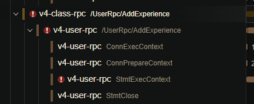
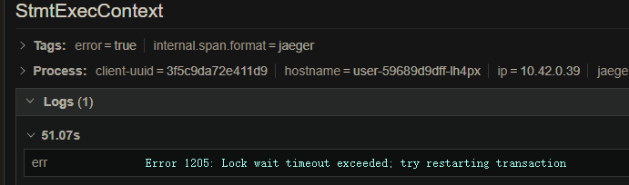

## 前言

并不是 MySQL 的死锁检测报错，而是一个业务代码架构上的问题导致的死锁。MySQL 只报了 `Error 1205: Lock wait timeout exceeded; try restarting transaction` 。

感觉还是值得一谈的。

## 现象

客户端每天第一次点评的时候响应速度极慢，从半分钟到一分钟不等。一开始测试跟我说这问题复现不出来，我暂时就没管。

第二天测试告诉我稳定复现了，第一次点评一定这么慢，于是要了客户端的日志，拿到请求 ID 后开始看跟踪情况。





## 排查

### 代码审阅和整理

查看源码，初步断定是一个 *每日点评奖励经验值* 的业务里调用了这个 `AddExperience` RPC 函数，因为 MySQL 错误提示是明确指出锁等待超时，所以还得看一眼 `AddExperience` 这个 RPC 函数里涉事的 SQL 语句。

```sql
insert user(experience,user_id) values(if(?>0,?,0),?) ON DUPLICATE KEY UPDATE experience=if(?>0,experience+?,experience)
```

好了，可以开始笑了。不要问我为什么这样写，又不是我写的...... 问了写下这句SQL的同事想做什么，回答就不放了，总之和这句 SQL 的实际干的事没什么关系。

基于奥卡姆剃刀原理先把这句 `insert on duplicate` 改成平平无奇的 `update` ，发现问题依然存在。

### 死锁来源

回到错误信息，`Lock wait timeout exceeded`，锁的是什么？从上面爆出错误的SQL看出应该是锁了 `user` 表，但不确定具体锁类型。

问题就变成了，谁加的锁？因为故障能稳定复现，开发环境几乎没有负载，也就是几乎不可能因为其他请求造成死锁，加锁者就在这个请求内。

于是重新纵览整个请求流程涉事的 SQL 语句，注意到几点：

1. 因为一些历史原因，涉事的 RPC 尚无分布式事务支持。
2. 请求 RPC 时，事务还没提交。

基本确认来源是事务内。排查发现并没有直接 `select ... from user` 这样的 SQL，但注意到有表和`user`表存在外键关联，涉事SQL是`insert into`。


查询MySQL文档没有收获（关于`insert`是否会锁外键的问题），但谷歌发现[stackoverflow 上已有相同的问题](https://stackoverflow.com/questions/54672633/do-mysql-transactions-for-insert-lock-foreign-key-referenced-tables)，答案是 yes，会在记录上加共享锁。

至此，死锁来源基本算查明了。

## 解决和预防

### 解决方案

处理说简单其实是简单的，把加经验的SQL挪到事务里就完事了，事实上也是这么解决的（如果看过之前我吐槽这项目的博客的话就会知道这项目就是农村无人管理的露天茅厕，矢上雕花大可不必）。

### 预防

微服务架构为什么要分库？在遇到这个问题前我也没什么直观的感受，大约是出于性能和扩展性的考量。但遇到这问题后我可以再补充个回答了：防呆。

在软件工程里怎么防止引入低质量代码有很多解决方法，比如机检、人工审阅、技术方案提前做设计评审、测试全覆盖等等，往大了说，可以再挑个阵营：TDD、DDD什么的，指导架构设计。尽量遵循最佳实践不要把坑再踩一遍诸如此类。学历史也不用从猿人扮演开始吧？

但真的很难避免一个已经很复杂的业务里引入一个看似简单的功能，结果因为架构上挖的坑导致产生难以排查的故障。

扯远了。这个问题预防说简单也简单，遵循最佳实践，该分库分库，加强代码审阅，提高意识巴拉巴拉。但凡能做到一点也不至于把这项目变成露天粪坑。总之，怎么给服务定好边界在最初的开发过程里就是最重要的问题。边界都不清晰，你中有我我中有你就别整什么微服务了。

架构设计上总是脱不开那句“高内聚、低耦合”，微服务的优势就在单个服务的独立性，可以独立开发、独立维护，不用对整个系统有深入了解。用了微服务，又不在服务间划清界限，用单体应用的思路一把梭写完再分成几个可执行文件，不出问题才是真的怪事，既不内聚又高耦合，还不如就写个单体应用，起码不用调试和部署的时候都跟吃了矢一样。

## 总结

顺便再一说，这项目现在还在同时用 `sql` 和 `xorm`，所以一个不小心，接口交叉使用了两个事务，还是会死锁。

越写越烦躁。先这样吧。