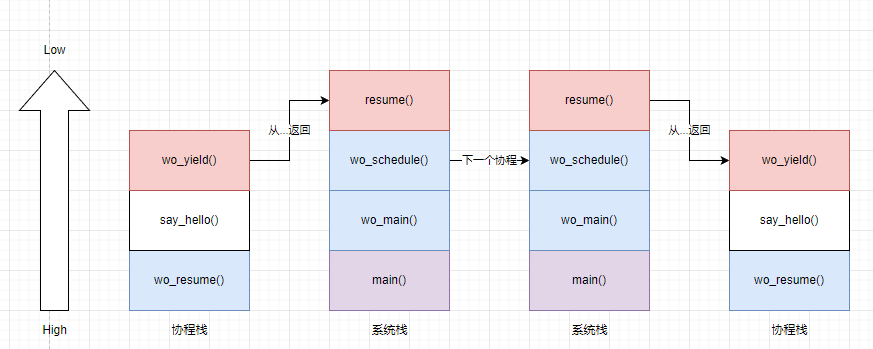
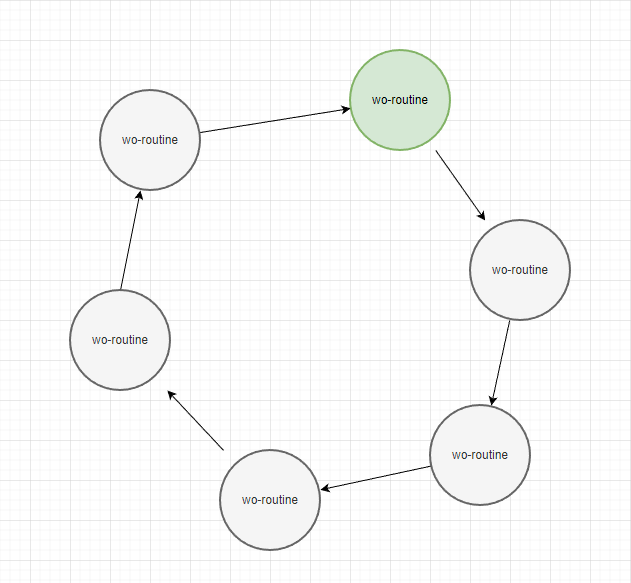
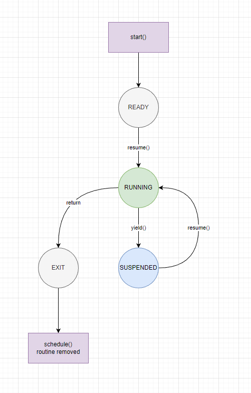
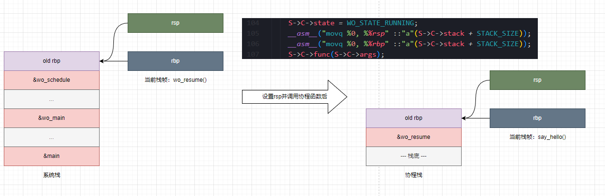
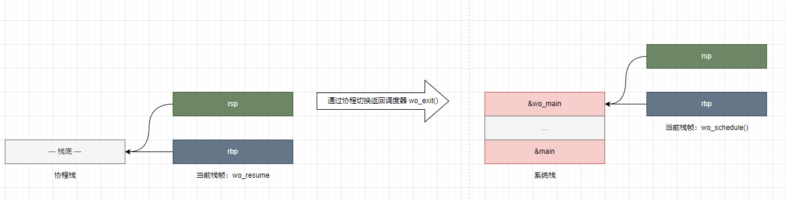
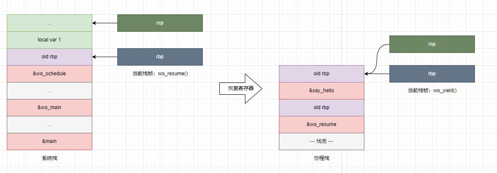

## 前言

尝试阅读分析云风大佬的 [cloudwu/coroutine](https://github.com/cloudwu/coroutine) ，学习协程的基本原理和实现，然后自己写一个。

## 原理

协程是协同运行的程序，不同语言的实现可以有很大差异。但从基本的来说，协程应该是要低于线程一级的，在用户态调度的程序。

既然是用户态调度，也就意味着开两个线程然后用信号量或互斥锁同步就不叫协程，因为线程都是内核调度和切换上下文的。

所以实现协程，实现的就是程序的上下文切换和调度分配，代码实现也关注这一块。

### 协同式协程

不确定有没有专有名词描述这种调度方式。

“协同式”，指的是需要协程主动放弃执行，调度器才切换调度其他协程运行的情况。协同式调度，协程可以自由决定什么时候交还控制权。

云风大佬的 coroutine 库就是协同式调度。

### 抢占式协程

如 go 的 `goroutine` 就是，不需要协程主动放弃执行，调度器会主动在合适的时候停止协程，或创建新的线程，来调度协程运行。

### 上下文切换

上下文切换，上下文指的是程序运行的状态。具体点说，包括：

- 寄存器（通用寄存器和浮点寄存器）
- 栈

以及一些其他的内容，比如监听/屏蔽的 UNIX 信号等，按平台可能有所区别。

在 Linux 上，GNU C Lib 提供了 `ucontext.h` 头文件暴露相关内核接口。而在 Windows 上，微软也也提供了 [fibers 抽象](https://docs.microsoft.com/en-us/windows/win32/procthread/fibers)。

### 调度

以协作式调度为例，只需要简单地在需要让出CPU时，主动保存自己的执行状态，恢复调度器的上下文，然后跳转到调度器继续执行即可。而恢复协程执行也是同理，将执行状态恢复后跳转回上一个中断点即可。

抢占式调度则更复杂一些，因为被调度的协程可能处于不能打断的状态或频繁打断产生性能上的负面影响。调度器需要综合多种因素，选择合适的时机打断和切换上下文。

## 实现

学习为主，云风的 coroutine 直接用了 `ucontext`，但我对 `ucontext` 实现的方式更好奇，所以选择自己用汇编实现上下文的保存和恢复。

由于是自己瞎造轮子，难免会有各种错误和潜在问题，但就这样吧。

### 初步设计



构想中的协程应该有自己的独立栈区，而调度器继续停留在系统栈。

调度器通过 `resume` 切换上下文到协程，协程通过 `yield` 切换上下文到调度器。当 `resume` 时，应该从协程上一次调用 `yield` 的地方（或函数入口）开始执行。而调用 `yield` 的时候，应该回到调度器上一次调用 `resume` 进入协程上下文的地方继续执行。

当所有协程都结束后，调度器正常返回。

### 实现思路

实现协程最大的难点就在如何切换上下文，我考虑的方法是通过修改 `bp` 和 `sp` 寄存器劫持返回地址，让`yield`和`resume`返回到对方的位置，来实现上下文切换。

### 协程和调度器结构

```c
struct wo_routine {
  uint64_t registers[17];  // 寄存器状态
  uint8_t *stack;          // 协程专属栈
  wo_fp func;              // 协程入口点
  void *args;              // 参数指针，存放到 RDI 寄存器
  wo_state state;          // 协程状态
  struct wo_routine *next; // 协程队列，环形链表
  struct wo_routine *prev; // 协程队列，环形链表
};

struct wo_scheduler {
  uint64_t registers[17]; // 调取协程的寄存器状态
  struct wo_routine *C;   // 当前正在运行的协程
};

// 调度器实例指针，每个线程独享一个
extern _Thread_local struct wo_scheduler *S;
```

基于上面的思路，设计出基本的协程结构。包含寄存器、栈、函数入口和参数。为了让多个协程可以轮流执行，将协程结构设计成一个环形链表，以允许随时插入新的协程，在当前协程后被调度执行。



协程本身也存在状态，不同状态的协程进入调度时会有不同的处理。



### API设计

依照上面的思路，可以比较简单地列出需要的接口：

- `wo_main`，主函数，必要的初始化和启动调度器，开始运行协程。
- `wo_start`，在工作队列里添加一个协程，可以在 `wo_main` 之前或协程中调用。
- `wo_yield`，只能在协程里调用，切换上下文到调度器。
- `wo_resume`，只能在调度器里调用，切换上下文到协程。

就是这些。

### 调度器部分实现

调度器主要工作是管理工作队列（协程组成的环形链表），添加协程或移除已结束的协程，在没有可调度协程时退出。

```c
void wo_schedule(void) {
  if (S->C == NULL) {
    return;
  }
  for (;;) {
    if (S->C == NULL) {
      break;
    }

    wo_resume();

    switch (S->C->state) {
    case WO_STATE_EXITED:
      // 从工作队列删除自己
      if (S->C != S->C->next && S->C->next != NULL) {
        S->C->next->prev = S->C->prev;
        S->C->prev->next = S->C->next;
        S->C = S->C->next;
        break;
      } else {
        return;
      }
    case WO_STATE_SUSPENDED:
      if (S->C != S->C->next && S->C->next != NULL) {
        S->C = S->C->next;
      }
      break;
    default:
      assert(false);
      return;
    }
  }
}
```

调度器主循环。

按设计协程 `yield` 或 `return` 后都是从 `resume` 返回。所以在`resume` 后 `switch` 检查协程的状态。如果协程是 `yield` 则状态为 `SUSPENDED`，调度器取下一个协程继续运行。若协程为 `return` 返回，结束运行，则进入 `EXIT` 状态，调度器从工作队列里删除协程。其他情况都是不应该出现的。

添加协程的 `start` 函数如下。

```c
void wo_start(wo_fp func, void *args) {
  if (S == NULL) {
    S = (wo_sp)calloc(1, sizeof(wo_s));
  }

  wo_rp routine = (wo_rp)calloc(1, sizeof(wo_r));
  routine->stack = (uint8_t *)malloc(STACK_SIZE);
  memset(routine->stack, 0, STACK_SIZE);
  routine->func = func;
  routine->args = args;
  if (S->C == NULL) {
    S->C = routine;
    return;
  }

  // 把自己插入队列
  if (S->C->next != NULL) {
    routine->next = S->C->next;
    S->C->next->prev = routine;
  } else {
    routine->next = S->C;
    S->C->prev = routine;
  }
  routine->prev = S->C;
  S->C->next = routine;
}
```

主要工作就是构造出 `wo_routine` 结构，初始化栈，然后加入工作队列，等待调度。

### resume

`resume` 负责保存上下文并切换到协程。切换到协程又分两种情况：

1. 协程处于 `READY` 状态，也就是还没开始执行，此时协程的寄存器、栈都是空的。
2. 协程处于 `SUSPENDED` 状态，也就是协程已经执行过，寄存器和栈保存的是协程 `yield` 时储存的状态。

当协程处于 `READY` 状态时是没法恢复上下文的，因为根本就不存在 *上一次执行时的上下文* 。`READY` 状态时 `resume` 做的并不是 *恢复* 上下文，而是 *构造* 一个合适的初始状态，让协程从这个初始状态开始执行。

在实现思路中提到过我想要控制 `sp` 寄存器，劫持返回地址来实现切换上下文，这里展开说一说具体怎么做。讨论限定在 Linux x86-64 GCC 编译器环境下。

还是从`READY`状态的协程开始说。

#### 启动新协程

新协程的启动主要考虑两个问题：

1. 如何让新协程用自己的栈和寄存器。
2. 如何让新协程开始执行。
3. 如何让新协程结束时返回到 `resume` 。避免在协程代码里调一次 `exit` 之类的函数，协程代码编写更自然。

对问题1，让新协程用自己的栈和寄存器可以很简单，保存主线程的寄存器状态，然后将`rsp`寄存器设置为协程栈的栈底即可。至于新协程的寄存器状态，我们需要关注的只有 `rdi`、`rsi` 这些 x86-64 基于寄存器的调用约定里，规定用于传递参数的寄存器即可。出于简化考虑，我们只在`start`中允许一个初始参数，所以设置好 `rdi` 寄存器的值即可。除`rsp`、`rdi`外，应该无需再设置其他寄存器的值。

对问题2和3，我的方法是正常调用协程函数。`call`指令会在协程栈上压栈返回地址，协程函数的序言部分会压栈`rbp`，然后把`rbp`设置成`rsp`，我们不需要关注旧的`rbp`值，在协程中不会再用到。



协程正常执行结束后，在返回时，会弹出`rbp`并返回到调用者，也就是 `resume` 中调用协程函数的地方。此时必须注意 `resume` 运行在协程栈上，而且`rsp`已经是栈底。如果在调用协程函数后直接`return`，会导致`rsp`越界读到无效的`rbp`和返回地址，让协程跑飞。在协程函数返回后，`resume` 里需要标记协程状态为结束，并手动做一次上下文切换，返回到调度器函数。



#### 恢复旧协程

对旧协程的恢复较为简单，因为`rsp`寄存器已经在 `yield` 中保存，恢复寄存器后栈状态其实和 `yield` 中相同。此时只要保证 `resume` 和 `yield` 函数的清栈操作相同（栈帧大小相同），清栈后 `rsp` 都能落在返回地址上，则 `resume` 的 `return` 实际等于 `yield` 中 `return` 。在 `resume` 的 `return` 执行后，就会返回到协程调用 `yield` 的位置。



#### 实现代码

```c
void wo_exit(void) {
  S->C->state = WO_STATE_EXITED;
  // 协程已结束。不保存上下文。
  // 恢复调度器上下文
  // 调度器独享系统栈所以不用复制栈，仅恢复寄存器状态
  __asm__("movq %0, %%rbx" ::"a"(S->registers[REG_RBX]));
  __asm__("movq %0, %%rcx" ::"a"(S->registers[REG_RCX]));
  __asm__("movq %0, %%rdx" ::"a"(S->registers[REG_RDX]));
  __asm__("movq %0, %%rsi" ::"a"(S->registers[REG_RSI]));
  __asm__("movq %0, %%rdi" ::"a"(S->registers[REG_RDI]));
  __asm__("movq %0, %%rsp" ::"a"(S->registers[REG_RSP]));
  __asm__("movq %0, %%rbp" ::"a"(S->registers[REG_RBP]));
  __asm__("movq %0, %%r8" ::"a"(S->registers[REG_R8]));
  __asm__("movq %0, %%r9" ::"a"(S->registers[REG_R9]));
  __asm__("movq %0, %%r10" ::"a"(S->registers[REG_R10]));
  __asm__("movq %0, %%r11" ::"a"(S->registers[REG_R11]));
  __asm__("movq %0, %%r12" ::"a"(S->registers[REG_R12]));
  __asm__("movq %0, %%r13" ::"a"(S->registers[REG_R13]));
  __asm__("movq %0, %%r14" ::"a"(S->registers[REG_R14]));
  __asm__("movq %0, %%r15" ::"a"(S->registers[REG_R15]));
  return;
}

void wo_resume() {
  // 保存上下文
  // 调度器运行在系统栈上，所以不保存栈，只记录寄存器
  __asm__("movq %%rbx, %0" : "=m"(S->registers[REG_RBX]));
  __asm__("movq %%rcx, %0" : "=m"(S->registers[REG_RCX]));
  __asm__("movq %%rdx, %0" : "=m"(S->registers[REG_RDX]));
  __asm__("movq %%rsi, %0" : "=m"(S->registers[REG_RSI]));
  __asm__("movq %%rdi, %0" : "=m"(S->registers[REG_RDI]));
  __asm__("movq %%rsp, %0" : "=m"(S->registers[REG_RSP]));
  __asm__("movq %%rbp, %0" : "=m"(S->registers[REG_RBP]));
  __asm__("movq %%r8, %0" : "=m"(S->registers[REG_R8]));
  __asm__("movq %%r9, %0" : "=m"(S->registers[REG_R9]));
  __asm__("movq %%r10, %0" : "=m"(S->registers[REG_R10]));
  __asm__("movq %%r11, %0" : "=m"(S->registers[REG_R11]));
  __asm__("movq %%r12, %0" : "=m"(S->registers[REG_R12]));
  __asm__("movq %%r13, %0" : "=m"(S->registers[REG_R13]));
  __asm__("movq %%r14, %0" : "=m"(S->registers[REG_R14]));
  __asm__("movq %%r15, %0" : "=m"(S->registers[REG_R15]));

  // 第一次进入时使用 call 方式，在栈底记录返回地址为 resume。
  if (S->C->state == WO_STATE_READY) {
    S->C->state = WO_STATE_RUNNING;
    __asm__("movq %0, %%rsp" ::"a"(S->C->stack + STACK_SIZE));
    __asm__("movq %0, %%rbp" ::"a"(S->C->stack + STACK_SIZE));
    S->C->func(S->C->args);
  } else {
    S->C->state = WO_STATE_RUNNING;
    // 恢复协程上下文
    __asm__("movq %0, %%rbx" ::"a"(S->C->registers[REG_RBX]));
    __asm__("movq %0, %%rcx" ::"a"(S->C->registers[REG_RCX]));
    __asm__("movq %0, %%rdx" ::"a"(S->C->registers[REG_RDX]));
    __asm__("movq %0, %%rsi" ::"a"(S->C->registers[REG_RSI]));
    __asm__("movq %0, %%rdi" ::"a"(S->C->registers[REG_RDI]));
    __asm__("movq %0, %%rsp" ::"a"(S->C->registers[REG_RSP]));
    __asm__("movq %0, %%rbp" ::"a"(S->C->registers[REG_RBP]));
    __asm__("movq %0, %%r8" ::"a"(S->C->registers[REG_R8]));
    __asm__("movq %0, %%r9" ::"a"(S->C->registers[REG_R9]));
    __asm__("movq %0, %%r10" ::"a"(S->C->registers[REG_R10]));
    __asm__("movq %0, %%r11" ::"a"(S->C->registers[REG_R11]));
    __asm__("movq %0, %%r12" ::"a"(S->C->registers[REG_R12]));
    __asm__("movq %0, %%r13" ::"a"(S->C->registers[REG_R13]));
    __asm__("movq %0, %%r14" ::"a"(S->C->registers[REG_R14]));
    __asm__("movq %0, %%r15" ::"a"(S->C->registers[REG_R15]));
    return;
  }

  // 协程结束时会返回到 resume
  // 此时上下文是协程栈，直接 return 会跑飞，所以还需要 yield 切换回系统栈
  // 再在 schedule 里从链表移除协程
  S->C->state = WO_STATE_EXITED;
  wo_exit();
}
```

此处关于 inline assembly 的写法，在最后会给出在线手册地址。

### yield

`yield` 负责保存协程的运行状态。因为协程栈是独立独享的，所以无需对协程栈做备份操作，只需要保存寄存器信息。

恢复调度器上下文的原理和`resume`的原理一样，只要保证`yield`和`resume`的栈帧大小一致清栈操作后`rsp`落到正确返回地址上，即可在恢复寄存器后直接`return`，就像是在 `resume` 里 `return` 一样。

```c
void wo_yield(void) {
  S->C->state = WO_STATE_SUSPENDED;

  // 保存协程上下文
  __asm__("movq %%rbx, %0" : "=m"(S->C->registers[REG_RBX]));
  __asm__("movq %%rcx, %0" : "=m"(S->C->registers[REG_RCX]));
  __asm__("movq %%rdx, %0" : "=m"(S->C->registers[REG_RDX]));
  __asm__("movq %%rsi, %0" : "=m"(S->C->registers[REG_RSI]));
  __asm__("movq %%rdi, %0" : "=m"(S->C->registers[REG_RDI]));
  __asm__("movq %%rsp, %0" : "=m"(S->C->registers[REG_RSP]));
  __asm__("movq %%rbp, %0" : "=m"(S->C->registers[REG_RBP]));
  __asm__("movq %%r8, %0" : "=m"(S->C->registers[REG_R8]));
  __asm__("movq %%r9, %0" : "=m"(S->C->registers[REG_R9]));
  __asm__("movq %%r10, %0" : "=m"(S->C->registers[REG_R10]));
  __asm__("movq %%r11, %0" : "=m"(S->C->registers[REG_R11]));
  __asm__("movq %%r12, %0" : "=m"(S->C->registers[REG_R12]));
  __asm__("movq %%r13, %0" : "=m"(S->C->registers[REG_R13]));
  __asm__("movq %%r14, %0" : "=m"(S->C->registers[REG_R14]));
  __asm__("movq %%r15, %0" : "=m"(S->C->registers[REG_R15]));

  // 恢复调度器上下文
  // 调度器独享系统栈所以不用复制栈，仅恢复寄存器状态
  __asm__("movq %0, %%rbx" ::"a"(S->registers[REG_RBX]));
  __asm__("movq %0, %%rcx" ::"a"(S->registers[REG_RCX]));
  __asm__("movq %0, %%rdx" ::"a"(S->registers[REG_RDX]));
  __asm__("movq %0, %%rsi" ::"a"(S->registers[REG_RSI]));
  __asm__("movq %0, %%rdi" ::"a"(S->registers[REG_RDI]));
  __asm__("movq %0, %%rsp" ::"a"(S->registers[REG_RSP]));
  __asm__("movq %0, %%rbp" ::"a"(S->registers[REG_RBP]));
  __asm__("movq %0, %%r8" ::"a"(S->registers[REG_R8]));
  __asm__("movq %0, %%r9" ::"a"(S->registers[REG_R9]));
  __asm__("movq %0, %%r10" ::"a"(S->registers[REG_R10]));
  __asm__("movq %0, %%r11" ::"a"(S->registers[REG_R11]));
  __asm__("movq %0, %%r12" ::"a"(S->registers[REG_R12]));
  __asm__("movq %0, %%r13" ::"a"(S->registers[REG_R13]));
  __asm__("movq %0, %%r14" ::"a"(S->registers[REG_R14]));
  __asm__("movq %0, %%r15" ::"a"(S->registers[REG_R15]));

  return;
}
```

## 使用

几个简单的用例。

### 单线程多协程

```c
void co1(void *args) {
  for (int n = 5; n >= 0; n -= 2) {
    printf("co1: n=%d\n", n);
    wo_yield();
  }
  return;
}

void co2(void *args) {
  for (int n = 4; n >= 0; n -= 2) {
    printf("co2: n=%d\n", n);
    wo_yield();
  }
  return;
}

void greeting(void *args) {
  for (int i = 0; i < 6; i++) {
    wo_yield();
  }
  printf("greeting: %s", (const char *)args);
  return;
}

void run_single(void) {
  wo_start(co1, NULL);
  wo_start(co2, NULL);
  wo_start(greeting, "Hello world!\n");
  wo_main();
  printf("run single end.\n");
}
```

### 多线程多协程

这个用例展示多个线程同时使用 `wo_main()` 启动协程调度器时的场景。未来如果有机会的话应该会再让多线程中的调度器调度对方的协程，甚至启动新调度器，就像 go 的 goroutine 一样。

```c
int thrd1(void *args) {
  wo_start(co1, NULL);
  wo_start(co2, NULL);
  wo_start(greeting, "Hello world!\n");
  wo_main();
  return 0;
}

int thrd2(void *args) {
  wo_start(co1, NULL);
  wo_start(co2, NULL);
  wo_start(greeting, "Hello world!\n");
  wo_main();
  return 0;
}

void run_parallels(void) {
  thrd_t t1, t2;
  thrd_create(&t1, thrd1, NULL);
  thrd_create(&t2, thrd2, NULL);
  thrd_join(t1, NULL);
  thrd_join(t2, NULL);
  printf("run parallels end.\n");
}
```

## 总结

参考资料列出如下。

- [GCC inline assembly HOWTO](http://www.ibiblio.org/gferg/ldp/GCC-Inline-Assembly-HOWTO.html)
- [cloudwu/coroutine](https://github.com/cloudwu/coroutine)
- [云风coroutine协程库源码分析](https://zhuanlan.zhihu.com/p/84935949)，评论区有些相关的项目和资料，谨慎参考。
- [Coroutine in C Language](http://www.vishalchovatiya.com/coroutine-in-c-language/)
- [getcontext implementation](https://gist.github.com/zhuowei/b8bc5d8d4a09c9437876)

这里手写汇编代码显然有问题，比如我存了所有通用寄存器但没有存 FPU 和 FLAGS 的状态，也没有存段寄存器。`ucontext`的实现考虑周全得多，用 `jmp` 也比我用 `return` 的形式好。再比如协程栈不能自动扩容，只有一个固定大小。

再对比 libco 的话，还缺少非常关键的系统调用异步化改造，让 io 时能自动 yield ，准备就绪后再继续执行。

我都不知道算不算摸到了云风大佬十年前水平的边角，太菜了我。
